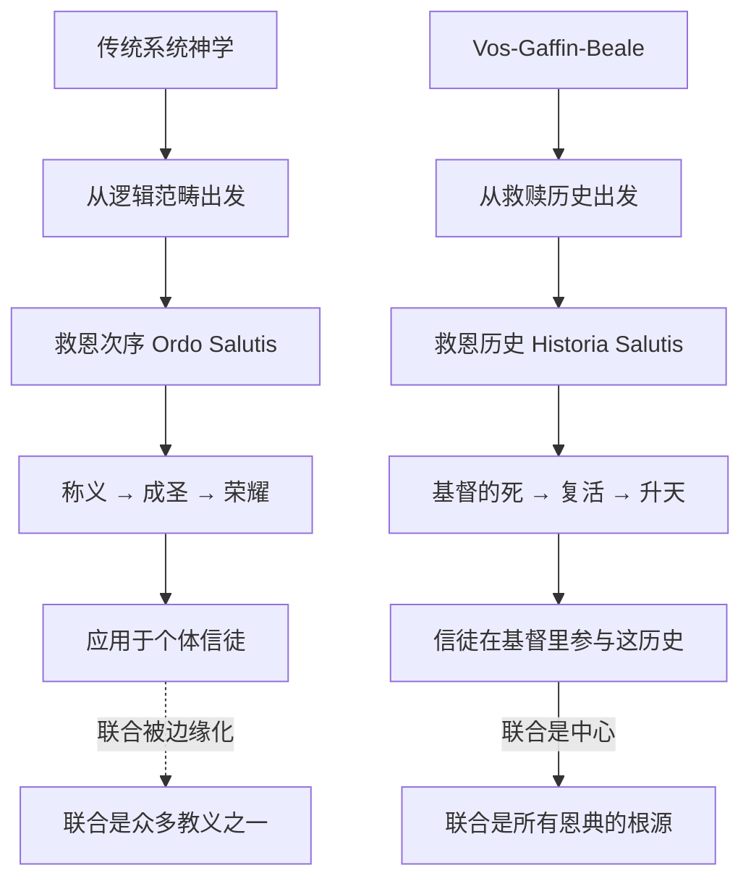
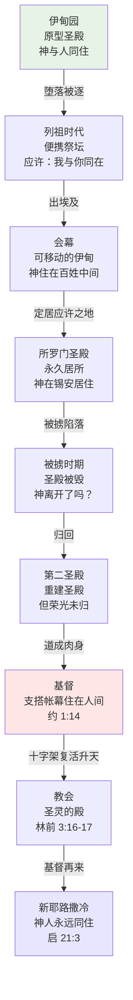

# WeDevote事工神学理论框架

---

## 版本信息

| 项目 | 内容 |
|------|------|
| 版本 | 2.0 |
| 日期 | 2026年1月29日 |
| 状态 | 神学理论参考，供战略制定、产品对齐 |
| 维护 | 微读战略规划小组 |

---

## Part I: 核心框架概述

### 0. 执行摘要（Executive Summary）

#### 0.1 一句话定位

以「与复活基督联合」作为本体核心；以「圣灵—圣道—教会—圣礼」作为恩典的中介经济；以「十架参与—苦难中显明复活」作为成圣形态；以「荣福直观/与神同住」作为终极目的——人被造是为了「面对面见神」，从伊甸的失落到新耶路撒冷的实现，圣经讲述的是神为人类开辟道路、使人能住在神圣临在中的故事。建立跨产品、可治理、可落地、可审视的神学架构。

#### 0.2 框架的三个关键决定

1. **先从本体论而非方法论出发**：不是从"怎么操练/怎么设计功能"开始，而是先回答"我们是谁、在谁里面、朝向谁"。联合不是一个功能，是一个存在状态。

2. **先从救赎历史而非救恩次序出发**：复活不是证明，而是新创造的启动；联合不是一条教义，而是整个救恩历史在个人与群体身上的"落地机制"。

3. **先承认张力而非追求统一感**：改革宗圣经神学与灵修操练传统并不总是可以无缝融合。该框架不强行和解，而是明确张力的位置。

#### 0.3 执行结果的可视化结构

```
                    ┌──────────────────────────────────────────────────┐
                    │   Layer 0: 终极目的 (Telos)                        │
                    │   ─────────────────────────────────────────────   │
                    │   荣福直观 / 与神同住——面对面见神（关系性实在）   │
                    │   「谁能登耶和华的山？」→ 基督已开了路              │
                    │   动态进展（epektasis）：从伊甸到新耶路撒冷的旅程  │
                    └─────────────┬────────────────────────────────────┘
                                  │
                    ┌─────────────▼────────────────────────────────────┐
                    │  Layer 1: 核心本体 (Union)                         │
                    │  与复活基督联合：位格连接、代表性参与、真实同参    │
                    │  称义/成圣/得荣 = 联合的多切面显现                │
                    │  基督是祭仪性亚当——一次永远进入天上圣所           │
                    └─────────────┬────────────────────────────────────┘
                                  │
                    ┌─────────────▼────────────────────────────────────┐
                    │ Layer 2: 中介经济 (Mediation)                      │
                    │  圣灵 + 圣道 + 教会 + 圣礼                         │
                    │  恩典的正式管道 + 恩典的可经验路径                 │
                    └─────────────┬────────────────────────────────────┘
                                  │
                    ┌─────────────▼────────────────────────────────────┐
                    │ Layer 3: 灵命塑造动力 (Formation)                  │
                    │  十架参与 / 苦难中显明复活 / 欲望重塑 / 操练节奏    │
                    │  VIM + 礼仪塑形 + 属灵操练 + 灵命更新动力          │
                    │  灵修 = 练习「进入神的同在」                        │
                    └──────────────────────────────────────────────────┘
```

#### 0.4 四层架构简明定义

| 层级 | 核心定义 | 核心贡献者 | 详细展开 |
|-----|---------|-----------|---------|
| **Layer 0: Telos** | 终极目的——荣福直观/与神同住，面对面见神。不是功能目标，而是关系性实在；包含动态进展（epektasis）。 | **Boersma** + **Morales** | Part IV §15-17 |
| **Layer 1: Union** | 本体核心——与复活基督联合。所有救恩恩典的根源，位格连接而非知识命题。 | **Vos-Gaffin-Beale** | Part II §1-5 |
| **Layer 2: Mediation** | 中介经济——圣灵 + 圣道 + 教会 + 圣礼。恩典的正式管道。 | **Ferguson**（圣灵） | Part IV §13 |
| **Layer 3: Formation** | 灵命塑造动力——十架参与、欲望重塑、操练节奏。灵修是「练习进入神的同在」。 | **Lovelace-Smith-Whitney-Willard** | Part III §7-10 |

> [!NOTE]
> **Layer 2 说明**：本框架聚焦于 Layer 0、1、3 的神学展开。Layer 2 的「圣道」、「教会」、「圣礼」维度在产品设计中有所涉及，但本文档未系统展开这三者的独立神学基础。圣灵维度参见 Ferguson 一节（§13）。

---

## Part II: Vos-Gaffin-Beale 传统的深度展开

> 三代神学家构成改革宗圣经神学的骨架—肌肉—器官系统。

### 1. 方法论革命：从系统逻辑到救赎历史

#### 1.1 问题诊断：传统救恩论的结构性问题

传统改革宗救恩论虽然教义正确，但在方法论上有一个隐蔽的问题——将**救恩历史**（Historia Salutis）的事件分解为**救恩次序**（Ordo Salutis）的逻辑步骤时，无意中将**复活**边缘化为"证明性事件"而非"构成性事件"。

传统救恩论的经典呈现：

```
            十字架（基督的工作）
                   ↓
        ┌─ 称义 ─┬─ 成圣 ─┬─ 得荣 ─┐
        ↓        ↓        ↓        ↓
      呼召  → 重生 → 信心 → 坚忍 → 荣耀
                   （Ordo Salutis）
```

**问题在哪里？**

1. **复活的定位模糊**：复活往往只出现在"基督的工作已完成"的证明中，或在"荣耀"的末尾，而非救恩的核心
2. **十字架的孤立**：基督的死与复活被处理为两个"事件"，而非一个不可分割的"行动"
3. **联合的边缘化**：与基督联合成为一个"附加"教义，而非整合性原理
4. **末世论的推迟**：末世论被放在系统神学的最后，而非渗透整个救赎论

#### 1.2 Vos 的方法论转换

Geerhardus Vos（1862-1949）面对的神学环境：
- 自由派神学用历史批评方法解构圣经
- 保守派神学用静态的系统范畴护教
- 双方都忽视了**救赎历史**（Heilsgeschichte）的有机发展

Vos 的核心洞见在于：**末世论不是系统神学的最后一章，而是保罗神学的组织框架**。这意味着：



**核心洞察**：这不是"正确 vs 错误"，而是**"从哪里看"**的问题。
- 从**信徒经验**出发 → Ordo Salutis（逻辑次序）
- 从**基督工作**出发 → Historia Salutis（历史叙事）

Vos-Gaffin-Beale论证：后者更符合保罗的思维方式。

#### 1.3 关键术语：אַחֲרִית הַיָּמִים（末后的日子）

Vos 对希伯来语 אַחֲרִית הַיָּמִים（*acherith hajjamim*，"末后的日子"）的分析揭示了末世论的核心结构：

**词源分析**：
- אַחֲרִית（*acherith*）来自 אַחַר（*achar*，"之后"）
- 本意是"后来的事"或"结局"
- 但在先知文学中，它承载了特殊的神学含义

**Vos 的关键洞见**：这个术语是**可移动的**（movable）和**弹性的**（elastic）——

| 特征 | 含义 | 神学意义 |
|-----|-----|---------|
| **可移动性** | 并非指向某个固定时间点 | 每一代人都可以将自己定位在"末后的日子"中 |
| **弹性** | 可以伸展涵盖不同时期 | 允许"已然/未然"的张力存在 |
| **相对性** | 相对于当前状态的"之后" | 总是指向决定性的转变 |

**新约的范式转换**：

在旧约中，"末后的日子"是**未来的盼望**；在新约中，它成为**现在的宣告**：

> "神既在古时借着众先知多次多方地晓谕列祖，就**在这末世**（ἐπ' ἐσχάτου τῶν ἡμερῶν）借着他儿子晓谕我们。"（来 1:1-2）

这不只是语言的改变，而是**本体论的突破**：基督的复活使"末后的日子"**已经开始**。

---

### 2. Vos：末世论作为保罗神学的框架

#### 2.1 两个世代的重叠（The Two Ages）

Vos 最核心的发现是保罗思想中的**两个世代重叠**结构：

```
旧约视角（线性期待）：
    今世 (עוֹלָם הַזֶּה)  →→→→→  来世 (עוֹלָם הַבָּא)
         ↑                        ↑
       this age              the age to come
                    
保罗的视角（重叠实在）：
    ┌─────────────────────────────────────────────────────────┐
    │                      今世仍在继续                         │
    │     ┌───────────────────────────────────────────────┐   │
    │     │              来世已经开始                       │   │
    │     │         （在基督复活中突入）                     │   │
    │     └───────────────────────────────────────────────┘   │
    └─────────────────────────────────────────────────────────┘
           ↑                    ↑                      ↑
       基督复活            信徒的现在             基督再来
       （已然）           （已然/未然）            （未然）
```

**Vos 的原话**：
> "在某种意义上，将来之世的生命已经成为'复活者'的财产，虽然它仍要等待完全的身体复活。"

#### 2.2 末世论与救赎论的互动：四条主线

Vos 在《保罗末世论》第二章详细分析了末世论如何塑造救赎论。他识别出四条互动主线：

##### 2.2.1 复活主线（Resurrection）

| 传统理解 | Vos 的理解 |
|---------|-----------|
| 复活*证明*基督的死有效 | 复活*完成*基督的救赎工作 |
| 复活是基督为我们做的 | 基督首先在复活中被"救赎"，然后我们在他里面被救赎 |
| 信徒等待未来复活 | 信徒已经与基督一同复活（弗 2:6） |

**Vos 的洞见**：林前 15:45 的"末后亚当成了叫人活的灵"（πνεῦμα ζῳοποιοῦν）表明复活不仅是身体复苏，而是**新创造样式的开启**。

##### 2.2.2 救恩主线（Salvation）

Vos 指出保罗思想中"救恩"有双重时态：

> "早期基督徒的心灵显示出一种持续的摆动（constant oscillation）——在当前的救恩与将来的救恩之间。"

这不是混乱，而是**末世论的必然结构**：
- **已然**：罗 8:24 "我们得救是在乎盼望"
- **未然**：罗 13:11 "我们得救，现今比初信的时候更近了"

##### 2.2.3 称义主线（Justification）

**Vos 最具革命性的洞见**：

> "称义是**预置的末日审判**（an anticipated last judgment）。"

这意味着：
- 称义不仅是法律宣告，更是**末世审判的提前**
- 信徒在今世已经领受了末日审判的判决
- 这赋予称义以绝对确定性——因为它是终末判决的预尝

##### 2.2.4 圣灵主线（Spirit）

Vos 将圣灵定位为"末世领域的元素"（the element of the eschatological sphere）：

- 圣灵是"初熟果子"（ἀπαρχή，罗 8:23）
- 圣灵是"凭据/订金"（ἀρραβών，林后 1:22; 5:5; 弗 1:14）
- 圣灵的内住本身就是末世生命的临在

**产品含义**：任何属灵操练的设计都不能绕过圣灵的主权工作。产品只能"预备接纳"，不能"保证结果"。

#### 2.3 垂直投射：从时间轴到天上

Vos 观察到一个关键的范式转换：

> "在水平时间面上的思维运动，转向了末世论兴趣向属天领域（the heavenly sphere）的**垂直投射**。"

这意味着：

| 复活前 | 复活后 |
|-------|-------|
| "末后的日子"是时间未来 | "末后的日子"也是空间上方 |
| 盼望指向"将来" | 盼望同时指向"天上" |
| 等待弥赛亚来临 | 与已升天的基督联合 |

**弗 2:6 的神学重量**：
> "他又叫我们与基督耶稣一同**复活**，一同**坐在天上**（συνεκάθισεν ἐν τοῖς ἐπουρανίοις）。"

这不是比喻，而是**本体论的宣告**：信徒的生命定位已经是"天上的"。此处句末重复的「在基督耶稣里」这一短语，以额外的强调指出：**整个向上运动的杠杆支点，就在于基督因复活而被移至高超领域这一事实**。

##### 2.3.1 从「接续性」到「共存」：新框架的诞生

Vos 详细分析了这种范式转换的必然性。旧约（及犹太教）的末世论建立在「接续性」（consecutiveness）的框架上——今世与来世是前后相继的。然而，当弥赛亚的来临成为「回望」的事实（以复活升天为标志），并因此必须承认末世进程在原则上已经开启时，旧有的视角便不再能与现实完全协调了。

Vos 指出，「接续性」框架之所以未被立即抛弃，真正的原因在于：**弥赛亚的显现自身也展开为两个相继的纪元（初临与再临）**。因此，「要来的世代」在其腹中孕育着另一个「要来的世代」——如同母亲与尚未出生的孩子，「现存的」与「将要来的」这一范畴必须被同时保留。

然而，在旧框架延续的同时，一个新框架也在诞生——它涉及两个世界或两种状态的「共存」（coëxistence）：

```
                    旧框架（接续性）
    ─────────────────────────────────────────────────────→
        今世                         来世
                      ↑
                弥赛亚来临（分界点）

                    新框架（共存）
    ─────────────────────────────────────────────────────→
        今世仍在继续
            ┌──────────────────────────────────────────┐
            │        来世已经开始（在天上）              │
            └──────────────────────────────────────────┘
                基督复活 → 圣灵浇灌 → 信徒的「现在」
```

##### 2.3.2 「半末世论」：监狱书信的特征

Vos 将这种视角描述为「半末世论的」（semi-eschatological）。这是保罗第一次被囚期间所写书信——以弗所书、歌罗西书、腓立比书——的特征。

**为何使用「天」的术语？**

Vos 解释了术语选择的神学原因：

| 术语 | 问题 | 结论 |
|-----|-----|-----|
| **kosmos**（宇宙/世界） | 因其邪恶关联意义，不适合表达「更高的世界」 | 不采用 |
| **aion**（世代） | 必须继续用于「这个世代」和「要来的世代」的区分 | 保留旧用法 |
| **天**（Heaven） | 能表达那暂时实现的终末状态，处于更高的平面上 | 采用新用法 |

因此，「天」的概念以及诸如「上面的事」这类以方位为导向的短语，取代了更古老的时间性术语。

**经文证据**：

- **弗 1:3**：基督徒「在天上各样属灵的福气」里，在基督里蒙福——信徒的居所和产业被转移到天上
- **弗 2:6**：信徒与基督一同复活，并与祂一同坐在天上——基督论基础：因为基督身在天上
- **腓 3:20**：基督徒的「πολιτεία」（公民身份）在天上——原因在于基督在那里
- **西 3:1-2**：信徒有责任去思念「上面的事」——动机在于基督在那里，且信徒的生命与基督一同藏在上帝里面

##### 2.3.3 并非削弱，而是强化

有人断言，这种从直视未来的前瞻性视线转向朝向属天世界的仰望，代表了对末世论热情的削弱（toning down）。**Vos 认为这种说法大错特错**。

实际上，将基督徒状态的核心与潜力锚定于天上的这整套表述，**并非是对信徒超世生命特质的废除，而是对其最强烈、最切实的宣告**。正因为它在很大程度上是一种初期的实现（incipient realization），其脸上才清晰地刻着末世论的印记。

> 「早期那种充满热切、带有几分焦灼的向前伸展的姿态，在此处让位给了一种更为平静安宁的、对另一世界及其内容的默观态度。但这绝非一个因盼望在盛宴之初屡屡落空，而忘却了饥饿之人的心态。恰恰相反，它标志着那种尖锐的、在某种程度上是痛苦的饥饿感，因着所获得的丰足的**临时满足**而消退了。部分的享受，反而**更加激发了对那丰盛的真正食粮的胃口**。」
>
> — Geerhardus Vos，《保罗末世论》

**关键区分**：基督徒凭着预尝所居住的天堂，**并非宇宙论意义上的天堂，而是一个彻底的「救赎性天堂」**——一个因着上帝在救赎领域历经世代的渐进建造与丰富，才成为如今样式的天堂。

##### 2.3.4 历史在先，神学在后

Vos 最后强调：**水平的历史性视角是更古老的那个，并且正是通过一个卓越的历史事件（基督的复活升天），才衍生出这两个领域并行的结构。历史在先，神学在后。**

既然后者源于前者，任何冲突的可能性从一开始就被排除了。视角的重新调整，也不会导致内在于基督信仰的末世论热情的减弱。这种双重性的根源在于**末世论的启示**（eschatological revelation），而非形而上学的思辨。

---

### 3. Gaffin：复活的构成性中心

Richard Gaffin（1936-）继承 Vos 的方法论，专注于一个核心问题：**复活在保罗救恩论中到底扮演什么角色？**

#### 3.1 复活：从证明性到构成性

Gaffin 最核心的论点可以用一个等式表达：

```
传统理解：
    基督的复活 = 证明性事件（证明十字架有效）

Gaffin 的理解：
    基督的复活 = 构成性事件（完成救赎工作本身）
                = 基督自己的"救赎"（从死亡中被拯救）
                = 新创造的真正开端
```

**关键经文：罗 4:25**

> "耶稣被交给人，是为我们的过犯；**复活**，是为叫我们**称义**。"

传统解经往往将"为叫我们称义"理解为"证明我们的称义"。但 Gaffin 指出，希腊文 διὰ τὴν δικαίωσιν（为了称义）表达的是**目的/结果**，而非仅仅证明。

**进一步证据：提前 3:16**

> "他在肉身显现，被圣灵**称义**（ἐδικαιώθη ἐν πνεύματι）。"

这表明**基督自己在复活中首先被称义/宣告为义**。信徒的称义是**参与**基督的被称义。

#### 3.2 确定性成圣：Gaffin 最重要的贡献

这是 Gaffin 对救恩论最具影响力的贡献之一：

| 确定性成圣（Definitive Sanctification） | 渐进性成圣（Progressive Sanctification） |
|----------------------------------------|----------------------------------------|
| 一次性事件 | 持续过程 |
| 与基督同死同复活时发生 | 在基督徒生活中展开 |
| 已经**是**圣洁的 | 正在**变得**更圣洁 |
| 身份的改变 | 行为的改变 |
| 指示语气（Indicative） | 命令语气（Imperative） |

**圣经依据**：

- 罗 6:6 — "我们的旧人**和他同钉十字架**"（过去时态，完成的事实）
- 西 3:9-10 — "因你们**已经脱去**旧人...**穿上了**新人"（过去时态）
- 弗 4:22-24 — 同样的"脱去-穿上"语言

**保罗的逻辑结构**：

```
你已经是X（指示语气） → 所以要活出X（命令语气）
你已经在基督里成圣      → 所以要活出圣洁
你已经脱去旧人          → 所以不要再按旧人行事
```

**牧养与产品含义**：

这彻底改变了属灵操练的定位：
- 操练不是**获得**身份，而是**活出**已有的身份
- 失败不是**丧失**身份，而是**未能显明**身份
- 产品功能应该先宣告"你是谁"，再呼召"你要做什么"

##### 3.2.1 旧约「洁净/不洁」背景

Gaffin 的「确定性成圣」在 Morales 对利未记的解读中获得丰富的旧约背景。

**核心洞见**：旧约的「洁净/不洁」不是卫生规范，而是**生命/死亡的象征系统**。

| 旧约概念 | 新约成全 | Gaffin 的表述 |
|---------|---------|--------------|
| טָמֵא（不洁）= 死亡的标记 | 罗 6:6「旧人钉死」 | 旧人**已经**与基督同钉 |
| טָהוֹר（洁净）= 生命的标记 | 罗 6:4「一举一动有新生的样式」 | 新人**已经**与基督同活 |
| 不洁者不能进入圣所 | 来 10:19「坦然进入至圣所」 | 信徒因基督的血**已经洁净** |

**关键经文整合**（来 10:19-22）：

> 「弟兄们，我们既因耶稣的血，得以**坦然进入至圣所**，是借着他给我们开了一条又新又活的路……并我们心中天良的亏欠**已经洒去**，身体用清水**洗净了**，就当存着诚心和充足的信心来到神面前。」

这段经文完美整合了：
- **Morales**：进入至圣所是人的终极目的
- **Gaffin**：洒去、洁净是已经完成的事实（确定性成圣）
- **实践**：因此要「存着诚心和充足的信心来到神面前」

**产品含义**：不是「洁净自己以便亲近神」，而是「因已被洁净，所以可以亲近神」。这个次序至关重要。

#### 3.3 十架神学：苦难中显明复活

Gaffin 继承路德的十架神学（Theologia Crucis），但赋予其末世论内涵：

**核心命题**：复活生命不是绕过十字架的"胜利后景"，而是"在十字架内被显明"的生命。

**林后 4:7-11 的深度解经**：

**v.7「我们有这宝贝放在瓦器里」**
- 「瓦器」= 信徒在身体存在中的脆弱性、必死性、朽坏性
- 「宝贝」= 福音/基督/末世荣耀
- **神有意设计**了「瓦器里的宝贝」——这不是偶然或不幸

**v.10「身上常带着耶稣的死，使耶稣的生也**显明**在我们身上」**
- νέκρωσις（nekrōsis，「死」）= 「持续朝向死亡的状态」——苦难、衰残、逼迫
- φανερωθῇ（phanerōthē，「被显明」）= 复活生命**唯独**通过软弱才能被显明
- πάντοτε（「常」）= 这是常态，而非例外

**三个关键洞见**：

1. **苦难是显明，而非缺席**
   - phanerōthē（被动态，被显明）的神学分量：复活生命不是被"掩盖"在软弱中等待释放
   - 而是**唯独**通过软弱才能被"显明"
   - 这不是"虽然软弱，但仍有生命"（让步关系）
   - 而是"**正因为**软弱，生命**在其中**被显明"（目的关系）

2. **受苦-荣耀是同时性，而非序列**
   - 腓 3:10「使我认识基督，晓得他复活的大能，**并且**晓得和他一同受苦」
   - καί（并且）是**解释性**的，不是让步性的
   - 「认识复活的大能」**就是**「和他一同受苦」——在现今世代，没有另一种途径

3. **不可浪漫化死亡**
   - 死亡对信徒仍是「罪之工价的最后残余」（the last remnant of sin's wages）
   - 神的爱不是在死亡中显明，而是「尽管有死亡」仍维持团契
   - 「离世与基督同在是好得无比的」——但好的是「与基督同在」，不是「死亡本身」

**三种错误的苦难神学**：

| 错误类型 | 描述 | Gaffin 的纠正 |
|---------|------|--------------| 
| **苦难是「等待」** | 苦难是现在，复活是将来；熬过苦难就能进入复活 | 苦难是复活生命**在现今**的彰显方式 |
| **苦难是「管教」** | 苦难是神改变我们的工具，本身没有末世论意义 | 苦难有末世论意义——它是「带着耶稣的死」 |
| **苦难是「测试」** | 苦难测试信心，通过后进入更高层次 | 苦难不仅是测试，更是复活生命运作的**场所** |

**瓦器必须破裂**：

> **瓦器之所以必须破裂，不是因为宝贝不够大，而是为了证明那能力是出于神。**

- 信徒不应试图「修补瓦器」——追求成功、健康、强大、无痛苦的生命
- 完整的瓦器**阻碍**了宝贝的流溢
- 「什么时候软弱，什么时候就刚强了」（林后 12:10）不是修辞悖论，而是末世论真实

**产品含义**：
- 允许用户在「瓦器破裂」中经历「宝贝的流溢」
- 不以「无苦难的成功」为目标
- 为失败、哀歌、迟缓留出恩典空间
- **警惕「成功神学」**——试图「修补瓦器」其实阻碍了复活生命的显明

##### 3.3.1 拿答、亚比户的警告：接近神的严肃性

Morales 对利未记 10 章（拿答、亚比户事件）的解读为 Gaffin 的十架神学提供了一个必要的张力：

> 「亚伦的儿子拿答、亚比户各拿自己的香炉，盛上火，加上香，在耶和华面前献上**凡火**，是耶和华没有吩咐他们的。就有火从耶和华面前出来，把他们烧灭，他们就死在耶和华面前。」（利 10:1-2）

**这个事件揭示的神学张力**：

| 一方面 | 另一方面 |
|-------|--------|
| 神渴望与人同住 | 神的圣洁不容污染 |
| 神开辟道路使人进入 | 但必须按照神定的方式 |
| 恩典是白白的 | 但不是随意的 |

Morales 的洞见：这个悲剧发生在会幕建成、神的荣光充满帐幕（利 9:23-24）之后立即发生。这提醒我们：**与神亲近是至高的特权，也是至严肃的事**。

**与 Gaffin 十架神学的整合**：

1. **不可廉价化恩典**：虽然瓦器必须破裂，但这不等于「怎么做都可以」
2. **圣洁的严肃性**：接近神需要基督开的路——这是为什么希伯来书强调「借着他给我们开了一条又新又活的路」
3. **基督的完美祭司工作**：基督不是像拿答、亚比户献凡火，而是献上完美的顺服

**产品含义的平衡**：
- 既要避免**律法主义**（「你必须做到X才能亲近神」）
- 也要避免**廉价恩典**（「怎么做都无所谓」）
- 正确定位：**因基督已开了路，我们可以坦然进入；但这路是有代价的，是基督的十架**

#### 3.4 Ordo Salutis 的重新定位

Gaffin 不否定 Ordo Salutis，但重新定位它与 Historia Salutis 的关系：

```
         Historia Salutis（历史维度）
                ↓
           基督的死与复活
                ↓
           信徒与基督联合
                ↓
    ┌──────────┼──────────┐
    ↓          ↓          ↓
  称义       成圣       荣耀
（法庭面向）（伦理面向）（末世面向）

注意：这三者不是时间次序，而是同一联合实在的不同角度
```

**关键洞察**：Ordo Salutis 不是信徒经验中的时间次序，而是对同一联合实在的**分析性区分**。称义、成圣、荣耀不是前后相继，而是同时发生——因为它们都根植于与基督的联合。

---

### 4. Beale：复活钻石与新旧约圣经的整合

G.K. Beale（1949-）继承 Vos-Gaffin 的框架，但将其扩展到整本新约，并发展出"复活钻石"的系统模型。

#### 4.1 复活钻石模型

Beale 用"钻石"隐喻表达与复活基督联合的多维实在：

```
                           ┌─────────────────────────┐
                           │   与复活基督联合        │
                           │   （钻石本身）           │
                           └─────────────────────────┘
                                     │
        ┌──────────┬─────────┬───────┼───────┬──────────┬──────────┐
        ↓          ↓         ↓       ↓       ↓          ↓          ↓
     神的儿子   末后亚当   真以色列    圣殿   君王祭司    被圣灵转化   神的形象
        │          │         │       │       │          │          │
       公义        智慧      救赎    圣洁     荣耀        能力       新创造
```

**本体论主张**：这些不是独立的教义步骤，而是同一实在（与复活基督联合）的不同视角。正如观察钻石的不同切面，你看到的是同一颗钻石，只是从不同角度。

#### 4.2 九个切面的详细展开

基于 Beale 《与复活基督联合》的论述：

##### 切面 1：神的儿子
- 基督是"神的长子"（πρωτότοκος，西 1:15, 18）
- 信徒因联合成为"众子"（υἱοί，罗 8:14; 加 3:26）
- 这不仅是法律收养，更是身份的真实转移

##### 切面 2：末后亚当
- 基督是"末后亚当"（ἔσχατος Ἀδάμ，林前 15:45）
- 信徒从"在亚当里"转移到"在基督里"
- 这是**团体人格**（corporate personality）的转换——代表性身份的改变

##### 切面 3：真以色列
- 基督是神选民的真正实现
- 信徒因联合成为"以色列的真正后裔"（加 3:29; 6:16）
- 教会不是"取代"以色列，而是在基督里成为真以色列

##### 切面 4：圣殿
- 复活的基督是末世圣殿（约 2:19-21）
- 信徒因联合成为"神的殿"（林前 3:16; 6:19; 弗 2:21）
- 这具有伦理含义：身体的使用有神圣意义

##### 切面 5：君王祭司
- 基督是"照麦基洗德等次"的祭司（来 7）
- 信徒因联合成为"有君尊的祭司"（彼前 2:9; 启 1:6）
- 这赋予日常生活以祭司性意义

##### 切面 6：被圣灵转化
- 基督在复活中被圣灵"称义"、能力充满（提前 3:16; 罗 1:4）
- 信徒因联合领受同样的圣灵（罗 8:9-11）
- 圣灵是"基督的灵"——经历圣灵就是经历复活基督

##### 切面 7：神的形象
- 基督是"那不能看见之神的像"（εἰκών，西 1:15）
- 信徒被"改变成主的形状"（林后 3:18）
- 这是渐进的过程："荣上加荣"

##### 切面 8：智慧与公义
- 基督成为信徒的"智慧、公义、圣洁、救赎"（林前 1:30）
- 这些不是独立的恩赐，而是基督**本身**成为这一切

##### 切面 9：荣耀与新创造
- 基督是"荣耀的主"（林前 2:8）
- 信徒将"同享他的荣耀"（罗 8:17）
- 林后 5:17 的正确翻译：不是"新**造的人**"（creature），而是"**新创造**"（new creation）——这是宇宙性的宣告

#### 4.3 团体人格：联合的群体维度

Beale 特别强调**团体人格**（corporate personality）这一古代近东概念：

**核心观念**：一个代表者可以**涵盖**整个群体的身份。

| 方面 | 古代理解 | 现代困惑 | 圣经实在 |
|-----|---------|---------|---------|
| 亚当的罪 | 亚当的罪是整个人类的罪 | "我没犯那个罪" | 在亚当里，你真实地参与 |
| 基督的义 | 基督的义是整个新人类的义 | "那是他的义" | 在基督里，你真实地联合 |

**Beale 的强调**：这不是比喻或法律虚构，而是**本体论实在**。

**教会论含义**：
- "在基督里"既是个人身份，也是群体归属
- 联合必然导向教会——与基督联合同时意味着与基督的身体联合
- 个人主义灵修是对联合本质的误解

#### 4.4 林后 5:17 的正确理解

Beale 特别强调这节经文的正确翻译：

> "若有人在基督里，他就是**新造的人**（和合本）。"

希腊原文：εἴ τις ἐν Χριστῷ, **καινὴ κτίσις**（kainē ktisis）

**Beale 的论点**：
- κτίσις 是"创造"而非"被造物"
- 正确翻译："若有人在基督里——新创造！"
- 这不是关于个人的内在更新，而是宣告**宇宙性新创造**已经开始
- 信徒是这新创造的"居民和参与者"

**神学含义**：
- 救恩不仅是个人修复，更是宇宙更新的一部分
- 信徒活在两个世代的交叠中——旧创造仍在，但新创造已经突入
- 这赋予基督徒生活以宇宙性意义

#### 4.5 圣殿神学：从伊甸到新耶路撒冷

Beale 的圣殿神学在 L. Michael Morales 的《谁能登耶和华的山？》中得到系统展开。Morales 与 Beale 高度互补，共同构成 Vos-Gaffin-Beale 传统中圣殿神学的完整图景。

> [!TIP]
> **Morales 完整展开**：本节提供 Morales 圣殿神学的概览，与 Beale 的钻石模型整合。关于 Morales 「与神同住」神学的完整展开及其与产品设计的关联，详见 Part IV §17：圣殿神学与利未记。

##### 4.5.1 伊甸园作为原型圣殿

Morales 论证伊甸园在创世记的呈现中就是一座圣殿：

| 伊甸园元素 | 圣殿对应 | 神学意义 |
|-----------|---------|---------|
| 神「在园中行走」（走动，מִתְהַלֵּךְ） | 神在会幕中「行走」（利 26:12） | 神与人直接同在 |
| 亚当「修理看守」（עָבַד + שָׁמַר） | 利未人「事奉看守」会幕（民 3:7-8） | 祭司职分 |
| 伊甸园中有生命树 | 圣殿灯台象征生命树 | 生命来自神的同在 |
| 基路伯守护入口 | 基路伯覆盖约柜 | 神圣空间的守护 |
| 向东的入口 | 会幕/圣殿的东向入口 | 朝向神的同在 |

**Morales 的洞见**：亚当的堕落不仅是「犯罪」，更是**被逐出神的同在**。受造物从此渴望回到伊甸——这成为整本圣经的叙事张力。

> 「耶和华神便打发他出伊甸园去，耕种他所自出之土。于是把他赶出去了。」（创 3:23-24）

被逐出伊甸园 = 被逐出神的同在。救赎历史的核心问题由此产生：**谁能登耶和华的山？**

##### 4.5.2 会幕：可移动的伊甸

当神指示摩西建造会幕时，他实际上是在旷野重造一个可移动的伊甸园：

```
                    会幕的三层结构与伊甸园对照
                    
    ┌──────────────────────────────────────────────────────┐
    │  至圣所（Holy of Holies）                             │
    │    = 伊甸园至深处                                     │
    │    - 约柜 + 施恩座                                    │
    │    - 神的临在（基路伯之间显现）                        │
    │    - 只有大祭司一年一次进入                            │
    └───────────┬──────────────────────────────────────────┘
                │
    ┌───────────┴──────────────────────────────────────────┐
    │  圣所（Holy Place）                                   │
    │    = 伊甸园                                           │
    │    - 金灯台（= 生命树）                               │
    │    - 陈设饼桌（= 生命树的果子）                        │
    │    - 香坛（= 祷告上升）                               │
    │    - 祭司在此事奉                                     │
    └───────────┬──────────────────────────────────────────┘
                │
    ┌───────────┴──────────────────────────────────────────┐
    │  外院（Outer Court）                                  │
    │    = 伊甸园外的世界                                   │
    │    - 铜祭坛（献祭）                                   │
    │    - 洗濯盆（洁净）                                   │
    │    - 以色列百姓可至此                                 │
    └──────────────────────────────────────────────────────┘
```

**神学要点**：

1. **会幕的建造与创造的七日对照**：出埃及记 25-31 章的结构呼应创世记 1 章的七日结构
2. **会幕作为微型宇宙**：会幕的装饰（蔚蓝、紫色、朱红色）象征天、地、海
3. **帐幕的「遮盖」**：עֹרֹת תְּחָשִׁים（海狗皮）遮盖会幕，如同水面上的天空遮盖大地

> [!IMPORTANT]
> 会幕不是「替代品」，而是「预表」。它指向一个更大的实在——神最终要与人完全同住，不再需要隔帘。

**创世叙事与会幕叙事的词汇平行**：

Morales 进一步指出，《出埃及记》结尾处会幕建造的完工，其描述方式与创世的完成相呼应，使用了高度相似的词汇和句式。这种互文平行关系确认了：**宇宙是一座大型圣殿，圣殿是一个微型宇宙**。

| 出埃及记 39–40 | 创世记 1–2 |
|--------------|----------|
| 摩西看见一切的工，看哪，他们都做成了 (39:43) | 上帝看他所造的一切，看哪，都甚好 (1:31) |
| 会幕，就是会幕，一切的工就这样完成了 (39:32) | 天地万物都齐备了 (2:1) |
| 摩西完工了 (40:33) | 上帝完成了他所做的工 (2:2) |
| 摩西给他们祝福 (39:43) | 上帝赐福 (2:3) |
| 使其成圣，并其间的一切器具 (40:9) | 定为圣日 (2:3) |

这种平行关系有两个重要的神学推论：

1. **会幕礼仪与创世相关联**：会幕的人员、器物和仪式都必须根据这种类比关系来理解（例如，大祭司可以被理解为亚当式的原型）
2. **会幕礼仪与宇宙的终局相对应**：创世时确立的人类目的（在安息日与神交通），现在只能通过以色列的会幕祭仪来实现

> 「你们要谨守我的安息日，敬畏我的圣所：我是耶和华。」（利 19:30）

##### 4.5.3 赎罪日：五经的神学中心

Morales 证明利未记 16 章（赎罪日，יוֹם הַכִּפֻּרִים）是整部五经的**文学与神学中心**：

```
创世记 → 出埃及记 → 利未记 1-15 → 【利未记 16（赎罪日）】 → 利未记 17-27 → 民数记 → 申命记
                                         ↑
                               五经的同心圆结构
                             一切都指向&从此流出
```

**赎罪日的核心问题**：

1. **神渴望与人同住**——这是创造的目的
2. **但人的罪使人不能存活于神的圣洁中**——这是堕落的后果
3. **如何解决这个张力？**——这是赎罪日要回答的

**两只山羊的神学意义**：

| 山羊 | 功能 | 神学意义 |
|-----|------|---------|
| **为耶和华的山羊** | 流血献祭，血洒在施恩座上 | 赎价已付，神的公义得满足 |
| **阿撒泻勒的山羊** | 承载百姓的罪，被送到旷野 | 罪被彻底挪移，不再记念 |

这两只山羊不是两个独立的救赎机制，而是**同一救赎工作的两个维度**：
- **向内**：与神和好（血进入至圣所）
- **向外**：罪被挪移（山羊被送到旷野）

**基督成全赎罪日**（来 9:11-12）：

> 「但现在基督已经来到，作了将来美事的大祭司，经过那更大更全备的帐幕，不是人手所造、也不是属乎这世界的；并且不用山羊和牛犊的血，乃用自己的血，只一次进入圣所，成了永远赎罪的事。」

基督既是大祭司（带着血进入至圣所），也是祭物本身（自己的血），又是阿撒泻勒的山羊（在城门外受苦）。

##### 4.5.4 大祭司作为「祭仪性亚当」

Morales 提出一个关键概念：大祭司是「祭仪性亚当」（Cultic Adam）。

在赎罪日，大祭司进入至圣所时的装束有特殊意义：

- **脱去华美的大祭司袍服**（出 28 章描述的宝石、金线袍服象征受造之荣光）
- **穿上朴素的细麻布衣裳**（利 16:4）

这象征着：大祭司代表人类，返回到堕落之前的状态，进入神的同在。他是**代表性的亚当**，做成亚当本应做成却未能做成的事——在神面前站立事奉。

**基督作为末后亚当**（林前 15:45）与此呼应：

| 第一亚当 | 祭仪性亚当（大祭司） | 末后亚当（基督） |
|---------|-------------------|----------------|
| 被托付看守圣园 | 进入至圣所服事一年一次 | 一次永远进入天上圣所 |
| 失败、被逐出 | 不完美，需年年再来 | 完美成就，坐下 |
| 代来诅咒 | 暂时遮盖 | 永远赎罪 |

##### 4.5.5 洁净/不洁：生命/死亡的象征系统

Morales 对利未记洁净律例的解读极具启发性：

> **洁净/不洁不是卫生规范，而是生命/死亡的象征系统。**

| 类别 | 「洁净」（טָהוֹר） | 「不洁」（טָמֵא） |
|-----|-----------------|-----------------|
| 实质 | 代表生命、秩序、神的同在 | 代表死亡、混乱、与神隔绝 |
| 物理对应 | 完整、活跃、正常 | 残缺、衰退、异常 |
| 神学对应 | 能亲近神 | 被隔绝于神的同在 |

**关键例证**：
- **漏症**（利 15）：身体边界被突破——象征死亡入侵
- **大麻风**（利 13-14）：皮肤腐烂——活人的身上出现死亡
- **尸体**：死亡本身是最大的不洁

这个象征系统揭示了一个深层真理：**人不能以死亡的状态进入生命之神的同在。**

**与 Gaffin「确定性成圣」的整合**：

信徒在基督里已经「洁净」——不是礼仪性的外在洁净，而是本体论的内在洁净。基督的血一次永远洁净信徒的良心（来 9:14），使他们能坦然进入至圣所（来 10:19-22）。

##### 4.5.6 圣殿神学的完整轨迹

整合 Beale 与 Morales 的圣殿神学：



**核心洞察**：整个救赎历史就是神不断「下山」寻找人、带领人「上山」回到神面前的历史。

---

### 5. 三代神学家的整合：骨架—肌肉—器官系统

#### 5.1 接力关系总结

| 神学家 | 核心贡献 | 对后继者的铺路 | 比喻 |
|-------|---------|--------------|----- |
| **Vos** | 圣经神学方法论；末世论是核心；已然-未然框架 | 为 Gaffin 提供方法论基础 | 骨架 |
| **Gaffin** | 复活的构成性意义；确定性成圣；联合统一救恩论；十架神学 | 为 Beale 提供系统框架 | 肌肉 |
| **Beale** | 全经整合；钻石模型；圣殿/形象/新创造神学；团体人格 | 完成完整的圣经神学呈现 | 器官系统 |

#### 5.2 共同的第一性原理

三代神学家共享一个可以表述如下的**第一性原理**：

> **基督的复活是末世新创造的真正开端；信徒与复活基督的联合，是所有救赎恩典的存在论基础。**

这不是一个教义结论，而是一个**解释学原则**——用它来重新组织整个救赎论。

#### 5.3 对普通信徒生活的影响

这个神学框架不是学术讨论，而是彻底改变日常生活的真理：

##### 5.3.1 身份认知的翻转

| 传统思维模式 | 联合神学的思维模式 |
|------------|------------------|
| "我是一个努力变好的罪人" | "我是在基督里的新造的人" |
| "我需要做更多来讨神喜悦" | "我已经在基督里被神完全接纳" |
| "如果我失败，我就不够好" | "我的身份不由我的表现决定" |
| "我盼望有一天成为圣洁" | "我现在就已经是圣洁的" |

##### 5.3.2 与罪争战的根本改变

**传统的"打地鼠"模式**：
```
发现罪 → 感到羞耻 → 努力压制 → 暂时得胜 → 再次失败 → 更深的羞耻
     ↑__________________________________________________|
                    （无限循环）
```

**联合神学的"身份驱动"模式**：
```
发现罪 → 承认这与我的真实身份不符 → 转向基督（我在他里面已经胜过这罪）
     → 从联合的能力中汲取力量 → 活出新人的生命
```

##### 5.3.3 得救确据的坚固根基

联合神学将确据建立在**客观事实**上：

```
确据的逻辑链：

1. 基督已经从死里复活（历史事实）
         ↓
2. 信徒已经与基督联合（一次性事件）
         ↓
3. 基督里的一切都属于信徒（本体论事实）
         ↓
4. 没有什么能使我们与基督的爱隔绝（罗 8:38-39）
         ↓
5. 我的确据不是基于我的感觉或表现，
   而是基于基督的复活和我与他的联合
```

---

### 6. 对产品与事工的具体含义

#### 6.1 产品不是"制造联合"，而是"对齐联合"

**错误的产品描述**：
- "帮助用户成长为更像基督的人"
- "促进用户的属灵转化"
- "提升用户的灵性水平"

**正确的产品描述**：
- "帮助用户活出已经与基督联合的现实"
- "对齐用户与已然发生的联合"
- "显明用户在基督里的真实身份"

#### 6.2 产品功能的神学检验

基于 Vos-Gaffin-Beale 框架，每个产品功能都应通过以下检验：

| # | 检验问题 | 通过标准 |
|---|---------|---------| 
| 1 | **联合测试** | 是否帮助用户"活出已发生的联合"而非"获得联合"？ |
| 2 | **确定性成圣测试** | 是否先宣告身份，再呼召行为？ |
| 3 | **十架测试** | 是否允许"瓦器破裂"？是否在苦难中显明复活？ |
| 4 | **已然/未然测试** | 是否同时承认"已经是"和"尚未完成"的张力？ |
| 5 | **团体人格测试** | 是否指向群体/教会，而非仅仅个人？ |
| 6 | **同住测试** | 是否帮助用户体验「进入神的同在」？是否将灵修定位为「与神同住」的练习？是否引导用户自问：「我是否活得像一个能进入神同在的人？」 |

> [!NOTE]
> **同住测试 说明**：基于 Morales 的核心命题——圣经神学的终极目的是「与神同住」。灵修不是完成宗教功课，而是练习进入神的同在。产品应帮助用户意识到他们正在「朝向至圣所」前进。此测试整合了「门廊礼仪」（Gate Liturgy）的概念——诗篇 24:3「谁能登耶和华的山？」这个问题贯穿整本圣经，从伊甸园之后「谁能回去？」到启示录「谁能进入新耶路撒冷？」。产品设计应帮助用户活在这个问题的张力中：因基督已开了路，我们可以坦然进入。

#### 6.3 警惕的偏差

| 偏差 | 表现 | 纠正 |
|-----|-----|-----|
| **律法主义** | 强调操练而忽视身份 | 先讲"你是谁"，再讲"你要做什么" |
| **成功神学** | 把"无苦难的成功"当作属灵成熟 | 苦难是复活生命的显明场所 |
| **个人主义** | 灵修与教会脱节 | 联合必然导向群体 |
| **未来主义** | 只关注将来的复活 | 信徒已经与基督一同复活 |
| **工具化亲近神** | 把「进入神的同在」当作获取平安/能力的手段 | 目的是神本身，不是效果 |
| **廉价恩典** | 「怎么做都无所谓」，忽视圣洁 | 基督开了路，但这路是十字架的路 |

---

## Part III：灵命塑造的动力学（Lovelace-Smith-Whitney-Willard）


### 7. 灵命更新的动力结构：Richard Lovelace

#### 7.1 Lovelace 的核心框架：「首要要素」与「次要要素」

Richard Lovelace 在 *Dynamics of Spiritual Life* 中提出了一个深具启发性的模型：灵命更新需要区分**首要要素**（primary elements）和**次要要素**（secondary elements）。

**首要要素**——福音的核心恩典：
1. **称义确据**（justification assurance）：知道自己在基督里被接纳，不再被定罪
2. **成圣动力**（sanctification）：持续被圣灵转化，活出新人的生命
3. **圣灵内住**（the indwelling Spirit）：神的灵真实住在信徒里面
4. **属灵争战权柄**（spiritual authority）：在基督里胜过仇敌

**次要要素**——福音的具体实践：
- 读经、祷告、禁食、团契
- 敬拜、服事、见证
- 属灵操练的各种形式

Lovelace 的核心论点是：**当首要要素健康运作时，次要要素自然流出；当次要要素被强调而首要要素萎缩时，教会陷入律法主义或形式主义。**

```
                     「首要要素」与「次要要素」的动力学
                     
                ┌─────────────────────────────────┐
                │    首要要素（福音的核心恩典）     │
                │                                 │
                │  ┌──────────┐  ┌──────────┐    │
                │  │ 称义确据  │  │ 成圣动力  │    │
                │  └──────────┘  └──────────┘    │
                │  ┌──────────┐  ┌──────────┐    │
                │  │ 圣灵内住  │  │ 争战权柄  │    │
                │  └──────────┘  └──────────┘    │
                └─────────────┬───────────────────┘
                              │
                        自然流出 ↓
                              │
                ┌─────────────┴───────────────────┐
                │    次要要素（操练的具体实践）     │
                │                                 │
                │  读经 · 祷告 · 禁食 · 敬拜      │
                │  团契 · 服事 · 见证 · 奉献      │
                └─────────────────────────────────┘
```

#### 7.2 「sarx」的强迫性有机体

Lovelace 对肉体（σάρξ, sarx）的分析极具启发性。他将 sarx 理解为一种**强迫性有机体**（compulsive organism）——这是一个深嵌于人格结构中的力量系统，不仅仅是个别的犯罪行为。

**传统理解的局限**：将罪主要理解为外在行为问题，因此对策是意志力抵抗和行为规范。

**Lovelace 的范式转换**：罪不仅是「选择」，更是一种深嵌人格中的**力量结构**。对抗它需要的不是更强的意志力，而是首要要素的全面运作：
- 称义确据打破定罪的权势
- 成圣过程逐步拆解旧有模式
- 圣灵内住提供新的生命动力
- 属灵争战权柄抵挡仇敌的攻击

**对产品设计的启示**：
- 任何「打地鼠」式的罪行为管理设计都将失败
- 需要帮助用户回到首要要素——先确认身份，再处理行为
- AI辅导逻辑应内置「首要要素检测」——当用户表现出属灵挣扎时，首先问：「你知道自己在基督里的身份吗？」

#### 7.3 万人祭司制度与群体更新

Lovelace 强调**万人祭司制度**（ἱεράτευμα βασίλειον, hierateuma basileion）的实际运作：

> 真正的群体更新意味着每个信徒都是彼此的牧者、辅导者和祷告伙伴。

这不是「参加主日崇拜和周间小组」，而是：
- 建立2-3人的深度问责小组，实践互相牧养
- 在辅导关系中整合「首要要素」——不仅劝诫行为改变，更帮助对方回到福音根基
- 教会结构应创造平信徒服事的空间，而非强化「专业人员垄断」

**对产品设计的启示**：
- 数字工具可以扩展群体的**覆盖范围**，但不能替代面对面的**深度辅导和问责关系**
- 产品应促进真实的人际连接，而非制造「社群感」的假象
- AI辅导应明确其边界——引导用户回到人的牧养关系中

---

### 8. 习惯与礼仪：James K.A. Smith

#### 8.1 核心命题：你是你所爱的

James K.A. Smith 在 *You Are What You Love* 中提出了人类学的根本挑战：

> 人不是首先思想的存在（homo sapiens），而是首先欲望的存在（homo liturgicus）。你的身份不是由你相信什么决定，而是由你爱什么决定。

这颠覆了启蒙运动以来对人的「理性主体」假设。Smith 指出我们是「习惯性动物」（creatures of habit）和「欲望机器」（desiring machines）：

| 传统人观 | Smith 的人观 |
|---------|-------------|
| 人是「思想的容器」 | 人是「欲望的动物」 |
| 知识决定行为 | 爱（终极关怀）决定行为 |
| 教育 = 输入信息 | 教育 = 塑造习惯 |
| 改变始于头脑 | 改变始于心——经过身体 |

#### 8.2 文化礼仪的解剖

Smith 将「礼仪」（liturgy）的概念从教会崇拜扩展到整个文化生活。他分析了购物中心、体育场馆、大学等「文化大教堂」如何作为世俗礼仪来塑造人的欲望：

**购物中心的礼仪分析**：
- **召唤仪式**：广告和门面设计召唤你进入
- **指向圣所**：导向核心商店（「圣殿」）
- **应许宣告**：「你值得拥有更好的」（福音的假冒）
- **奉献仪式**：付款——将资源献给「神」
- **差遣仪式**：带着购物袋离开——成为品牌的见证人

Smith 的洞见：**我们不是主动选择这些价值观，而是被这些重复的习惯/礼仪所塑造**。

```
                        文化礼仪的塑造机制
                        
        ┌─────────────────────────────────────────┐
        │              重复的习惯/礼仪              │
        │                   │                     │
        │                   ↓                     │
        │         身体层面的重复实践               │
        │                   │                     │
        │                   ↓                     │
        │       想象力的重新定向（vision of life）  │
        │                   │                     │
        │                   ↓                     │
        │            欲望被重塑                    │
        │                   │                     │
        │                   ↓                     │
        │           自动化的行为倾向               │
        └─────────────────────────────────────────┘
```

#### 8.3 「新礼仪」（Counter-Liturgy）：以基督教礼仪对抗世俗礼仪

Smith 的解决方案不是拒绝所有礼仪，而是用**基督教的新礼仪**（Counter-Liturgy）来重新训练欲望：

| 世俗礼仪 | 基督教新礼仪 |
|---------|------------|
| 消费主义的「你值得」 | 恩典宣告：「你是被爱的」 |
| 竞争的等级秩序 | 洗脚礼：最大的要服事众人 |
| 即时满足的期待 | 教会年历：在等待中学习盼望 |
| 原子化的自我 | 圣餐：与基督和彼此联合 |

**对产品设计的启示**：
- 数字产品本身就是「礼仪」——每天打开app的仪式在塑造我什么？
- 不能只问「用户学到什么」，更要问「用户被塑造成什么」
- 设计应该是「新礼仪设计」——对抗注意力经济的掠夺性礼仪
- 考虑身体性：如何通过数字界面促进具身的（embodied）属灵实践？

#### 8.4 家庭作为第一所礼仪学校

Smith 特别强调家庭的礼仪功能：

> 家庭不是「传递信仰知识」的机构，而是「形成习惯」的车间。

家庭礼仪的关键要素：
- **节奏**：固定的家庭灵修时间
- **重复**：饭前祷告、睡前祝福
- **具身性**：一起唱诗、跪下祷告
- **故事性**：讲述家族的信仰故事

**对产品设计的启示**：
- 发展「家庭模式」功能——支持家庭而非仅个人的属灵操练
- 设计应该促进「代际传承」——父母和孩子一起使用
- 注意避免将属灵生活原子化——产品应服务于家庭单元

---

### 9. 属灵操练的方法论：Donald Whitney

#### 9.1 核心框架：敬虔的目标与途径

Donald Whitney 在 *Spiritual Disciplines for the Christian Life* 中提出：

> 「操练自己以至于敬虔」（γύμναζε δὲ σεαυτὸν πρὸς εὐσέβειαν，提前 4:7）

这里的 γυμνάζω（gymnazō）是体育训练的术语，强调：
- **刻意性**：不是自然发生，而是有意识的努力
- **重复性**：如同运动员的日常训练
- **目的性**：目标是 εὐσέβεια（eusebeia，敬虔/像神）

**关键区分**：

| 概念 | 定义 | 与恩典的关系 |
|-----|-----|------------|
| 属灵操练 | 恩典的途径（means of grace） | 操练不是赚取恩典，而是将自己放在恩典流动的位置 |
| 律法主义 | 试图通过行为赚取神的恩惠 | 把途径当作目的 |
| 反律法主义 | 因强调恩典而忽视操练 | 不愿使用恩典的途径 |

Whitney 的核心公式：
> **Godliness = Desire + Discipline**

没有渴望的操练是律法主义；没有操练的渴望是虚假的属灵主义。

#### 9.2 十二项核心操练

Whitney 列举的核心属灵操练：

| 操练 | 圣经根据 | 核心要义 |
|-----|--------|---------|
| **圣经摄取** | 诗 1:2 | 不仅是「读」，而是听、读、研读、背诵、默想——五种方式 |
| **祷告** | 帖前 5:17 | 不仅是「说话」，而是 ACTS（赞美、认罪、感恩、代求）的结构 |
| **敬拜** | 诗 96:9 | 不仅是「感觉」，而是将神所启示的荣耀归给他 |
| **默想** | 诗 77:12 | 不是「放空」，而是有内容的深度思考——以经文为材料 |
| **传福音** | 徒 1:8 | 不是「销售」，而是分享基督里的新生命 |
| **服事** | 加 5:13 | 不是「自我实现」，而是舍己地爱邻舍 |
| **管家职分** | 林前 4:2 | 不是「奉献」而已，而是认识到一切都属于神 |
| **禁食** | 太 6:16-18 | 不是「饮食控制」，而是以渴慕神取代渴慕食物 |
| **安静独处** | 可 1:35 | 不是「隔离」，而是刻意进入无分心的神圣时空 |
| **日记** | 诗 77:11 | 不是「日志」，而是记录与神同行的旅程 |
| **学习** | 箴 18:15 | 不是「积累知识」，而是被真理塑造 |
| **坚忍** | 来 12:1 | 不是「熬过去」，而是在长跑中保持方向 |

#### 9.3 圣经摄取的五重方法

Whitney 特别详细地论述了「圣经摄取」的五种方式：

```
                     圣经摄取的五重递进
                     
           听道 ←─→ 读经 ←─→ 研经 ←─→ 背经 ←─→ 默想
             │        │        │        │        │
          被动接收   主动阅读  深入挖掘  内化于心  反复咀嚼
             │        │        │        │        │
           水面      水下      深海      融入     消化
```

默想是最高层次——不是额外的操练，而是将其他四种方式的果实**内化**。

Whitney 引用 Spurgeon 的比喻：
> 默想就像「牛反刍」——把吃下去的草再嚼一遍，直到完全消化。

**对产品设计的启示**：
- 灵修产品应设计「五层摄取」功能——不仅是阅读，还有听、研、背、默
- 默想模块应该是核心——帮助用户从「读过」到「内化」
- 避免「信息过载」设计——与其提供更多内容，不如帮助用户深入咀嚼

#### 9.4 圣经祷告法

Whitney 最具操作性的贡献之一是「圣经祷告法」——以经文为材料祷告：

**步骤**：
1. **读一段经文**（通常是诗篇或新约书信）
2. **在每一节停下来**，将经文内容转化为祷告
3. **继续读下一节**，重复这个过程
4. **经文在哪里结束**，讲章就在哪里结束（而非时间）

**示例**（诗篇 23:1）：

> 「耶和华是我的牧者」
> - 主啊，感谢你是我的牧者——你不仅创造我，更牧养我
> - 求你帮助我今天像羊一样跟随你的引导
> - 保守我不要走自己的路，而是跟随好牧人的声音
> 
> 「我必不致缺乏」
> - 主啊，我承认我常常觉得缺乏——资源、时间、能力
> - 但你应许我在你里面不会缺乏
> - 帮助我信靠你的供应，而非焦虑……

**对产品设计的启示**：
- 开发「圣经祷告」引导模块——逐节提供祷告提示
- 可以预设不同的祷告模式：个人默祷、夫妻同祷、小组公祷
- AI可以根据经文内容生成祷告引导——但要谨慎，不要替代用户自己的祷告

---

### 10. 灵命塑造的整全架构：Dallas Willard

#### 10.1 核心问题：门徒训练的缺失

Dallas Willard 在 *Renovation of the Heart* 中提出了一个震撼性的诊断：

> 现代教会最大的问题不是人不信耶稣，而是信耶稣的人不跟随耶稣。

Willard 区分「相信耶稣」（believing in Jesus）和「做耶稣的学徒/门徒」（being an apprentice of Jesus）：

| 「相信」模式 | 「门徒」模式 |
|------------|------------|
| 接受一套教义 | 学习一种生活方式 |
| 获得死后的门票 | 进入现在的天国生活 |
| 偶尔的宗教活动 | 持续的生命转化 |
| 耶稣是救世主 | 耶稣是老师/师傅 |

**Willard 的挑战**：如果耶稣是世界上最聪明的人（他确实是），为什么我们不向他学习如何生活？

#### 10.2 人的六个维度

Willard 提出人由**六个相互关联的维度**组成：

```
                        人的六个维度
                        
                     ┌───────────────┐
                     │    灵魂       │
                     │ （整合中心）   │
                     └───────┬───────┘
                             │
           ┌─────────────────┼─────────────────┐
           │                 │                 │
      ┌────┴────┐      ┌────┴────┐      ┌────┴────┐
      │  心思   │      │  感情   │      │  意志   │
      │(thoughts)│     │(feelings)│     │ (will) │
      └─────────┘      └─────────┘      └─────────┘
           │                 │                 │
           └─────────────────┼─────────────────┘
                             │
                     ┌───────┴───────┐
                     │     身体      │
                     │ （行动载体）   │
                     └───────┬───────┘
                             │
                     ┌───────┴───────┐
                     │    社会关系    │
                     │ （群体嵌入）   │
                     └───────────────┘
```

**每个维度都需要被「更新」（renovation）**：
1. **心思**：思想的内容、方式、焦点需要被更新——「心意更新」（罗 12:2）
2. **感情**：情感的模式、反应、深度需要被更新——从恐惧到爱
3. **意志**：选择的能力和方向需要被更新——从自我中心到神中心
4. **身体**：身体的习惯、反应、能力需要被更新——成为义的器具
5. **社会关系**：与他人的关系需要被更新——从竞争到服事
6. **灵魂**：作为整合中心，需要被更新——恢复与神的连接

#### 10.3 VIM 模型：改变的逻辑

Willard 提出了著名的 **VIM 模型**：

> **V**ision（异象）+ **I**ntention（意愿）+ **M**eans（途径）= **Transformation**（转化）

```
        VIM 模型：灵命塑造的动力学
        
        ┌─────────────────────────────────────────────┐
        │                                             │
        │    V: Vision（异象）                        │
        │    - 看见生命可以成为什么样                  │
        │    - 看见耶稣的生命品质                      │
        │    - 看见天国生活的可能性                    │
        │                                             │
        ├─────────────────────────────────────────────┤
        │                                             │
        │    I: Intention（意愿）                     │
        │    - 不仅是「想要」，而是「决定」            │
        │    - 不仅是愿望，而是委身                    │
        │    - 愿意付出代价                            │
        │                                             │
        ├─────────────────────────────────────────────┤
        │                                             │
        │    M: Means（途径）                         │
        │    - 属灵操练                               │
        │    - 建立新习惯                              │
        │    - 融入群体                                │
        │                                             │
        └─────────────────────────────────────────────┘
                            │
                            ↓
                ┌───────────────────────────────┐
                │     Transformation（转化）     │
                │     渐进的、持续的生命改变     │
                └───────────────────────────────┘
```

**常见的错误**：
- 缺少 Vision：不知道要成为什么样的人
- 缺少 Intention：只有模糊的愿望，没有坚定的决定
- 缺少 Means：有愿望但不知道如何操练

#### 10.4 天国「当下性」

Willard 最革命性的洞见之一是强调天国的**当下性**：

> 天国不仅是将来要进入的地方，更是现在就可以生活的实在。

他重新解释「天国近了」（ἤγγικεν ἡ βασιλεία τῶν οὐρανῶν）：
- 不只是「快来了」
- 更是「已经触手可及」
- 你现在就可以进入神的统治

**对产品设计的启示**：
- 避免将属灵生活仅仅定位于「预备将来」
- 强调「现在」的天国生活——这一刻就可以活在神的同在中
- 每日操练不是「投资将来」，而是「活在当下的天国中」

#### 10.5 四层灵命塑造整合

将 Lovelace-Smith-Whitney-Willard 的框架整合：

| 神学家 | 核心贡献 | 与 Vos-Gaffin-Beale 的连接 |
|-------|--------|--------------------------|
| **Lovelace** | 首要要素 vs 次要要素 | 「首要要素」= 联合的恩典根基 |
| **Smith** | 习惯/礼仪塑造欲望 | 习惯形成 = 活出联合的方式 |
| **Whitney** | 属灵操练的方法论 | 操练 = 将自己放在联合恩典流动的位置 |
| **Willard** | VIM 模型与六维度 | 全人转化 = 联合在各个维度的落实 |

```
                    四层灵命塑造整合架构
                    
   ┌────────────────────────────────────────────────────┐
   │              与复活基督联合（本体论根基）            │
   │            （Vos-Gaffin-Beale 框架）               │
   └────────────────────────┬───────────────────────────┘
                            │
                            ↓
   ┌────────────────────────────────────────────────────┐
   │              首要要素：福音的核心恩典               │
   │               （Lovelace 的诊断）                  │
   │   称义确据 · 成圣动力 · 圣灵内住 · 争战权柄        │
   └────────────────────────┬───────────────────────────┘
                            │
                            ↓
   ┌────────────────────────────────────────────────────┐
   │              习惯与礼仪：欲望的重塑                 │
   │               （Smith 的洞见）                     │
   │   反文化礼仪 · 身体性实践 · 家庭节奏 · 教会年历    │
   └────────────────────────┬───────────────────────────┘
                            │
                            ↓
   ┌────────────────────────────────────────────────────┐
   │              属灵操练：恩典的途径                   │
   │               （Whitney 的方法）                   │
   │   圣经摄取 · 祷告 · 禁食 · 默想 · 安静独处         │
   └────────────────────────┬───────────────────────────┘
                            │
                            ↓
   ┌────────────────────────────────────────────────────┐
   │              全人更新：六维度的转化                 │
   │               （Willard 的架构）                   │
   │   心思 · 感情 · 意志 · 身体 · 社会 · 灵魂          │
   └────────────────────────────────────────────────────┘
```

---

## Part IV：补充视角——七位神学家的贡献

### 11. 有限性神学：Kelly Kapic

#### 11.1 核心命题：有限不等于有罪

Kelly Kapic 在 *You're Only Human* 中提出了一个被长期忽视的神学真理：

> 人的有限性（finitude）是神的善良设计，而非需要克服的缺陷。

**关键区分**：

| 概念 | 定义 | 神学地位 |
|-----|-----|---------|
| **有限性**（finitude） | 时间、空间、能力的受限 | 创造中的**善良**设计 |
| **罪性**（sinfulness） | 对神旨意的悖逆 | 堕落的**恶**后果 |

这两者在当代文化和教会中常被混淆：
- 我们把疲劳当作软弱——但疲劳是被造的身体的正常反应
- 我们把无法做到一切当作失败——但无法做到一切是有限存在的正常状态
- 我们把需要他人帮助当作羞耻——但依赖是设计中的特性

#### 11.2 健康压力与有罪焦虑

Kapic 做出另一个关键区分：

| 概念 | 性质 | 神学评估 |
|-----|-----|---------|
| **压力**（stress） | 对负载的身体反应 | 中性——是有限身体的正常响应 |
| **焦虑**（anxiety） | 对未来的不信任恐惧 | 负面——可以是罪（太 6:25-34） |

**对产品设计的启示**：
- 避免将「休息」设计为可选的奢侈
- App的使用不应增加用户的「属灵焦虑」
- 设计应该正常化限制——不是每天都要「完成」灵修
- 打卡机制需谨慎——可能强化「效率=敬虔」的错误等式

#### 11.3 依赖性是设计特征

Kapic 强调：依赖性是创造的**设计特征**，而非堕落的后果。

> 亚当在堕落之前就需要神、需要夏娃、需要伊甸园的供应。需要不是软弱，是设计。

**反对自足神话**：现代文化推崇「独立」「自给自足」，但这是对人本质的误解。我们被造就是需要：
- 需要神——这是正常的
- 需要彼此——这是正常的
- 需要休息——这是正常的
- 需要帮助——这是正常的

**对产品设计的启示**：
- 设计应该促进「健康的依赖」——引向神、引向群体
- 避免强化「自我提升」「自我拯救」的暗示
- 「进度追踪」功能需要谨慎设计——避免把属灵生活变成独自的「自我项目」

---

### 12. 与基督联合的深度：J. Todd Billings

#### 12.1 核心框架：*En Christō* 作为身份根基

J. Todd Billings 在 *Union with Christ* 中论证：

> **ἐν Χριστῷ**（en Christō，「在基督里」）是保罗神学的中心，也是基督徒身份的根基。

统计数据显示，「在基督里」及其变体在保罗书信中出现超过160次——这不是外围装饰，而是核心架构。

#### 12.2 称义与成圣的「不可分离」

Billings 强烈反对将称义与成圣分开处理：

```
        ┌──────────────────────────────────────┐
        │                                      │
        │        与基督联合（Union）            │
        │                                      │
        │     ┌────────────────────────────┐   │
        │     │                            │   │
        │     │     称义                   │   │
        │     │ （Justification）          │   │
        │     │                            │   │
        │     ├────────────────────────────┤   │
        │     │                            │   │
        │     │     成圣                   │   │
        │     │ （Sanctification）         │   │
        │     │                            │   │
        │     └────────────────────────────┘   │
        │                                      │
        │   两者在联合中不可分离，如同硬币两面   │
        │                                      │
        └──────────────────────────────────────┘
```

**批评对象**：
- **律法主义**：只强调成圣，忽视称义
- **反律法主义**：只强调称义，忽视成圣
- **神学二元论**：将两者分成「阶段」——先称义，后成圣

Billings 的论点：在联合中，两者同时发生、不可分割。

#### 12.3 对抗 MTD

Billings 使用「道德性治疗主义自然神论」（Moralistic Therapeutic Deism, MTD）来诊断当代基督教的偏差：

| MTD 特征 | 对比：联合神学 |
|---------|--------------|
| 神存在是为了帮助我们感觉良好 | 我们存在是为了荣耀神并享受他 |
| 「做好人」是信仰的核心 | 「在基督里」是身份的核心 |
| 神不太干涉日常生活 | 神与我们联合——深度参与 |
| 宗教是个人的治疗资源 | 信仰是群体的盟约关系 |

**对产品设计的启示**：
- 内容不应强化 MTD——「让你感觉更好」不是目标
- 身份先于行为——先宣告「你是谁」，再讨论「你要做什么」
- 避免将属灵生活私有化——强调教会和群体维度

#### 12.4 联合的七个维度

Billings 的 *en Christō* 分析揭示了联合的丰富性。综合 Vos-Gaffin-Beale 的末世论框架与 Moo 的创造神学，与复活基督的联合展现为七个相互关联的维度：

| 维度 | 核心宣告 | 经文根基 | 产品关注 |
|-----|---------|---------|---------|
| **D1 身份** | 你是新造的人、神的儿女 | 林后 5:17; 罗 8:15-17 | 先宣告身份，再呼召行为 |
| **D2 法律/收养** | 你被称义、被接纳为子 | 罗 5:1; 加 4:4-7 | 指示语气 ≥ 命令语气 |
| **D3 转化** | 你正在被改变，且必然完成 | 罗 6:1-14; 腓 1:6 | 允许「瓦器破裂」 |
| **D4 认知/经验** | 认识神包括真实的相遇 | 腓 3:10; 弗 1:17-19 | 经文先于体验 |
| **D5 群体/教会** | 你被接入基督的身体 | 林前 12:12-27; 弗 2:19-22 | 指向线下教会 |
| **D6 使命** | 联合必然外溢为见证服事 | 太 28:18-20; 弗 2:10 | 使命是联合的外溢 |
| **D7 创造** | 与受造界的关系被恢复 | 罗 8:19-21; 西 1:20 | 避免人类中心主义 |

---

### 13. 圣灵作为基督的灵：Sinclair Ferguson

#### 13.1 核心命题：以基督为中心的圣灵论

Sinclair Ferguson 在 *The Holy Spirit* 中提出：

> 圣灵首先是「基督的灵」（πνεῦμα Χριστοῦ, pneuma Christou）。圣灵的工作不是独立的，而是「将基督的工作应用于我们」。

这直接挑战了两种偏差：
1. **圣灵忽视论**：只关注基督和父，圣灵边缘化
2. **圣灵过度独立论**：将圣灵的工作与基督的工作分开

Ferguson 的平衡：圣灵的全部工作都是**将基督所成就的应用于信徒**。

#### 13.2 「已然-未然」的圣灵论

Ferguson 将 Vos-Gaffin 的「已然-未然」框架应用于圣灵论：

| 维度 | 已然 | 未然 |
|-----|-----|-----|
| 圣灵内住 | 圣灵已经住在信徒里面（林前 6:19） | 完全的圣灵充满尚待末世 |
| 圣灵作为定金 | *ἀρραβών*（arrabōn）——已经给付的首期款 | 完整「产业」尚未领受 |
| 圣灵的叹息 | 我们「心里叹息」是圣灵工作的证据 | 叹息表明救赎尚未完成 |

**Ferguson 的关键洞见**：
> 「叹息」和「等候」不是圣灵缺席的证据，而是圣灵临在的证据——正是因为圣灵已经住在我们里面作为「初熟果子」，我们才渴望完全的救赎。

**对产品设计的启示**：
- 正常化属灵生活中的「叹息」——这不是失败
- 避免承诺「属灵完满」——在「未然」中保持张力
- 将困难和等待框架为「已然-未然」张力的正常部分

#### 13.3 圣灵与成圣

Ferguson 论述圣灵在成圣中的角色：

1. **确定性成圣**：圣灵已经将信徒分别为圣——这是完成的事实
2. **渐进性成圣**：圣灵持续在信徒生命中工作——这是进行中的过程
3. **终末性成圣**：圣灵将在末日完成这工作——这是确定的盼望

这三者不是三个阶段，而是同一圣灵工作的**三个维度**。

---

### 14. 祷告作为神学实践：Timothy Keller

#### 14.1 祷告的双重性质

Timothy Keller 在 *Prayer* 中论证：

> 祷告既是**对话**（conversation），也是**相遇**（encounter）。

| 对话维度 | 相遇维度 |
|---------|---------|
| 与神交谈 | 与神同在 |
| 言语的交换 | 位格的接触 |
| 理性参与 | 情感参与 |
| 可以学习的技巧 | 需要培养的关系 |

两者都是必要的：只有对话而没有相遇，祷告变成任务；只有相遇而没有对话，祷告变成模糊的神秘主义。

#### 14.2 John Owen 的三阶段框架

Keller 借用 John Owen 的框架描述祷告中的灵魂旅程：

```
        Owen 三阶段框架
        
        ┌────────────────────────────────────────┐
        │                                        │
        │  1. Mind（理智）                       │
        │     - 理解经文的含义                    │
        │     - 神学上准确地把握真理              │
        │     - 「这节经文说什么？」              │
        │                                        │
        ├────────────────────────────────────────┤
        │                                        │
        │  2. Heart（心灵）                      │
        │     - 感受真理的分量                    │
        │     - 让真理触动情感                    │
        │     - 「这对我意味着什么？」            │
        │                                        │
        ├────────────────────────────────────────┤
        │                                        │
        │  3. Affections（与神相遇）             │
        │     - 从真理进入与神的亲密              │
        │     - 真正与神相遇                      │
        │     - 「我现在正在与这位神同在」        │
        │                                        │
        └────────────────────────────────────────┘
```

**对产品设计的启示**：
- 灵修引导可以设计「三层递进」——从理解到感受到相遇
- 避免只停留在信息层——追求推动用户进入更深的层次
- 默想模块应该有意识地促进从 Mind 到 Heart 到 Affections 的转移

#### 14.3 Luther 的四重方法

Keller 借用 Luther 的四重解经祷告法：

| 拉丁术语 | 意义 | 应用问题 |
|---------|-----|---------|
| *Instructio* | 教导 | 这段经文教导我什么真理？ |
| *Gratiarum actio* | 感恩 | 我应该为什么感谢神？ |
| *Confessio* | 认罪 | 这段经文光照我什么罪？ |
| *Oratio* | 祈求 | 我应该为什么祷告？ |

这与传统的 ACTS 模型（Adoration, Confession, Thanksgiving, Supplication）类似，但更加以经文为根基。

---

### 15. 荣福直观与终极目的：Hans Boersma

#### 15.1 核心命题：*Visio Beatifica* 作为人的 *Telos*

Hans Boersma 在 *Seeing God* 中恢复了「荣福直观」（visio beatifica, beatific vision）的教义：

> 人的终极目的（*telos*）是「面对面见神」——这不仅是天堂的奖赏，更是人被造的目的。

**关键经文**：
- 「清心的人有福了，因为他们必得见神」（太 5:8）
- 「如今我们仿佛对着镜子观看，模糊不清；到那时就要面对面了」（林前 13:12）
- 「我们必要像他，因为必得见他的真体」（约壹 3:2）

#### 15.2 *Epektasis*：永恒的渐进

Boersma 借用 Gregory of Nyssa 的 *ἐπέκτασις*（epektasis）概念：

> 永生不是静态的「到达」，而是**永恒的、不断加深的**对神的认识和享受。

这解决了「天堂会无聊吗？」的问题：因为神是无限的，对他的认识永远不会穷尽。永生是永恒的**进入更深**，而非永恒的**站在原地**。

**对产品设计的启示**：
- 属灵成长不是「达到终点」，而是「不断深入」
- 避免「毕业」心态——没有「完成」的那一天
- 强调「旅程」而非「目的地」——但旅程有方向（面向神）

#### 15.3 圣礼本体论

Boersma 论证一种「圣礼本体论」（sacramental ontology）：

> 受造物不是与神分离的「东西」，而是「参与」（participatio）在神的存在中。

这与 Beale 的新创造神学呼应——受造物从一开始就是指向神的。

#### 15.4 「与神同住」：荣福直观的圣经神学根基（L. Michael Morales）

如果 Boersma 从**哲学-神秘主义传统**阐述荣福直观，那么 L. Michael Morales 在 *Who Shall Ascend the Mountain of the Lord?* 中则从**圣经神学进路**提供了同样的洞见。

> [!TIP]
> **Morales 完整展开**：本节展示 Morales 如何补充 Boersma 的 Layer 0 神学。关于 Morales 圣殿神学、赎罪日、祭仪性亚当等议题的完整展开，详见 Part IV §17：圣殿神学与利未记。

Morales 在本书开篇即宣告其核心命题：

> "YHWH's opening a way for humanity to dwell in the divine Presence"（耶和华为人类开辟一条道路，使其能住在神圣临在之中）

这一命题贯穿全书，成为解读利未记乃至整部五经的诠释钥匙。Morales 论证：**圣经神学的中心戏剧不是「救赎」本身，而是「与神同住」——救赎是手段，与神面对面的团契才是目的。**

##### 15.4.1 「פָּנִים」（面）的神学

Morales 特别关注「面」（פָּנִים，panim）这个词在创世记中的神学意义。「见神的面」是圣经中描述与神亲密关系的核心意象：

| 经文 | 「面」的神学 |
|-----|-----------|
| 该隐被逐：「我必躲避你的面」（创 4:14） | 被隔绝于神的同在是最深的咒诅 |
| 挪亚蒙恩：「挪亚在耶和华面前蒙恩」（创 6:8） | 在神面前站立是最大的祝福 |
| 亚伯拉罕：「你当在我面前行走，作完全人」（创 17:1） | 圣洁是为了在神面前站立 |
| 雅各：「我面对面见了神，我的性命仍得保全」（创 32:30） | 见神的面是危险又渴慕的 |

摩西的祈求「请让我看见你的荣耀」（出 33:18）本质上就是「请让我见你的面」。而赎罪日大祭司进入至圣所，正是为了「见神的面」——代表全以色列恢复与神面对面的关系。

> [!NOTE]
> 「见神的面」在旧约中既是最大的祝福（「愿耶和华用脸光照你」民 6:25），也是最大的危险（「人见我的面不能存活」出 33:20）。这个张力只有在基督里才得到解决。

这与 Boersma 的「荣福直观」形成完美的呼应：人的终极目的是「面对面见神」，而整本圣经就是这个目的逐步实现的叙事。

##### 15.4.2 「门廊礼仪」：贯穿圣经的结构性问题

Morales 引入「门廊礼仪」（Gate Liturgy）的概念来解读诗篇 15 和 24 篇：

> **谁能登耶和华的山？谁能站在他的圣所？**（诗 24:3）

这个问题不是修辞性的，而是**礼仪性的**——它是进入圣殿前的入口询问。这个问题贯穿整本圣经：

```
伊甸园之后：
    谁能回到伊甸园？
西奈山上：
    谁能上神的山？
利未记核心：
    谁能进入至圣所？
新约应许：
    谁能进入天上的圣所？
启示录高潮：
    谁能进入新耶路撒冷？
```

**终极答案**（启 22:4）：

> 「他们要见他的面。他的名字必写在他们的额上。」

这就是 Boersma 所说的「荣福直观」——面对面见神。Morales 的贡献在于揭示这个主题如何贯穿整本圣经，从伊甸到新耶路撒冷。

##### 15.4.3 安息日：创造的 Telos

在讨论「与神同住」的救赎历史轨迹之前，必须回到创世叙事本身。Morales 引用亚伯拉罕·赫舍尔（Abraham Heschel）的洞见指出安息日在创造中的核心地位：

> **「在创世中最后，在意向中最初，安息日是创造天地的终局。」**

这句话准确地捕捉到了创世记 1:1–2:3 对安息日的强调——该叙事以一个包含七个词的希伯来语句子开始，通过七个段落展开，并在安息日的圣化中达到高潮。第七日被三次强调（创 2:2a, 2b, 3），是整部创世记中唯一被「圣化」（*wayĕqaddēš*）的对象。

**安息日的神学意义**：

| 特征 | 神学含义 |
|-----|---------|
| 第一个被祝福的日子 | 时间本身承载神圣的祝福 |
| 唯一被圣化的日子 | 创造的目标指向与神交通 |
| 三次强调第七日 | 叙事的高潮而非附录 |
| 唯一没有「有晚上有早晨」结语 | 安息日指向永恒，而非循环 |

**人类的目的与第七日**：

传统解经常将第六日人类的创造视为叙述的「高潮」。然而 Morales 指出，只有在第七日的光照下，第六日详述的人类的特殊地位才具有意义：

> 「人类并不是创造的顶点，而是**在安息日与上帝交通的人类**。这种与神圣者的交往是——且唯有它——能够实现上帝形象的目的和潜能。」

换句话说：
- **上帝的形象**：是为了「效法上帝」（即守安息日为圣）
- **效法上帝**：是为了在安息日「与上帝联合」
- **与上帝联合**：是人被造的终极目的

**与 Layer 0 的整合**：

安息日神学为 Boersma 的「荣福直观」提供了**创造论根基**：

```
创世叙事的目标结构：

    第一日 → 第六日
         （预备与建造）
              ↓
         第七日：安息日
    （目的、圣化、与神交通）
              ↓
    人类的终极目的 = 在安息中与神同在
              ↓
    荣福直观 / 与神同住 / 面对面见神
```

> [!NOTE]
> **产品含义**：灵修产品的设计应帮助用户进入「安息日的节奏」——不是完成任务，而是进入与神同在的时空。属灵操练的目标不是「效率」，而是「同在」。

##### 15.4.4 从伊甸到新耶路撒冷：「与神同住」的救赎历史轨迹

Morales 追踪「与神同住」主题贯穿整个圣经正典：

```
                    「与神同住」的救赎历史轨迹
                    
    伊甸园（神与人同住）
         │
         ↓ 堕落——被逐出神的同在
         │
    列祖时期（应许：我必与你同在）
         │
         ↓ 出埃及——归回的开始
         │
    西奈山 / 会幕（神住在百姓中间）
         │
         ↓ 定居应许之地
         │
    圣殿（神在锡安居住）
         │
         ↓ 被掳——再次被逐
         │
    道成肉身（神住在人中间——约 1:14）
         │
         ↓ 十字架与复活
         │
    教会（神住在人里面——圣灵内住）
         │
         ↓ 基督再来
         │
    新耶路撒冷（神与人永远同住——启 21:3）
```

> 「看哪，神的帐幕在人间。他要与人同住，他们要作他的子民。神要亲自与他们同在，作他们的神。」（启 21:3）

这个轨迹揭示了 Boersma「荣福直观」的**救赎历史维度**：它不仅是神秘主义的渴慕，更是神从创世以来一直在成就的计划。

#### 15.5 宇宙创生模式：「水→山→与神同住」

Morales 识别出一个贯穿圣经的「宇宙创生模式」（Cosmogonic Pattern）：

```
经过审判之水 → 到达神的山 → 与神同住的生命
```

这个模式在整本圣经中反复出现：

| 事件 | 经过水 | 到达山 | 与神同住 |
|-----|-------|-------|---------| 
| **创世记 1** | 水面上的灵 | 分开水使旱地出现 | 神在第七日安息 |
| **挪亚** | 洪水审判 | 方舟停在亚拉腊山 | 献祭，神与挪亚立约 |
| **出埃及** | 过红海 | 到达西奈山 | 神降临，赐下律法与会幕 |
| **约书亚** | 过约旦河 | 进入应许之地 | 在示罗建立会幕 |
| **基督** | 受洗（经过水的审判） | 复活升天 | 坐在父的右边 |
| **教会** | 洗礼 | 来到锡安山（来 12:22） | 圣灵内住 |
| **末世** | 「海也不再有了」（启 21:1） | 新耶路撒冷降下 | 神与人同住 |

这个模式对理解救恩至关重要：**救恩不是人「登山」到神那里，而是神「下山」来寻找人，然后带着人一起「上升」**。

**与 Vos 的「已然-未然」框架整合**：

信徒已经「来到锡安山」（来 12:22），但尚未完全「见他的面」。我们已经经过洗礼之水，正在朝向神的山上升，等候与神完全同住。

#### 15.6 Boersma 与 Morales 的互补关系

> 关于 Layer 0 的完整定义，见本文档开篇 0.1 及 0.3 节。

| 维度 | Boersma | Morales |
|-----|---------|--------|
| **方法论** | 教父/中世纪神秘传统 | 圣经神学/利未记研究 |
| **核心概念** | Visio Beatifica | 与神同住 / 见神的面 |
| **时间性** | 永恒的渐进（epektasis） | 救赎历史的展开 |
| **空间性** | 圣礼本体论 | 伊甸-圣殿-新耶路撒冷 |

两者是同一实在的不同表达，彼此互补。

---

### 16. 创造神学与管家职分：Douglas Moo

#### 16.1 为什么需要创造神学？

| 潜在偏差 | 表现 | 神学问题 |
|---------|-----|---------|
| **人类中心主义** | 救恩主要被理解为「人的得救」 | 忽视「万有」（τὰ πάντα）都在救赎范围内 |
| **灵魂 vs 物质二元论** | 强调「灵性」生命，物质世界边缘化 | 道成肉身肯定物质世界的价值 |
| **个体化救恩** | 救恩是「我与耶稣的个人关系」 | 忽视救赎的宇宙维度（西 1:20） |

> **「关心创造不是基督教信仰的附加选项，而是对创造主的敬拜、对管家职分的忠诚、对福音见证的内在要求。」**
>
> — Douglas Moo

**Moo 与 Vos-Gaffin-Beale 的神学契合**：

| 对接点 | Vos-Gaffin-Beale | Moo 的创造神学 |
|-------|-----------------|--------------|
| **新创造** | 基督的复活是新创造的开端 | 新创造包括整个受造界的更新 |
| **已然-未然** | 信徒活在两个世代的交叠中 | 受造界「叹息劳苦」，等候更新（罗 8） |
| **末世论** | 末世不是毁灭，而是更新 | 新天新地是 καινός（性质更新）而非 νέος（全新替换） |
| **联合的宇宙维度** | 林后 5:17「若有人在基督里——新创造！」| 这宣告包括与受造界的新关系 |

#### 16.2 创世记的创造神学

**「看着是好的」——创造的内在价值**

创世记 1 章的「好」（טוב, tov）不仅是功能性的「有用」，而是**本体论的善**：

| 经文 | 「好」的对象 | 神学意义 |
|-----|-----------|---------|
| 创 1:4 | 光 | 光在被造之时就**是**好的 |
| 创 1:10 | 地和海 | 无生命的受造物也被称为好 |
| 创 1:21 | 海生物和飞鸟 | 动物的价值不依赖于对人的用处 |
| 创 1:31 | **一切所造的** | 「甚好」（טוב מאד）——整体的和谐 |

> **「受造物的价值不依赖于我们对它的看法或它对人类的表面用处。我们的目标必须是学会像神那样看世界，学会像他那样爱和珍视它。」**

**管家职分：统治（רָדָה）与服务（עָבַד）**

创世记 1:28 的「治理」（רָדָה, radah）和创世记 2:15 的「修理看守」（עָבַד שָׁמַר）常被误解：

| 误解 | Moo 的校正 |
|-----|----------|
| 「统治」= 剥削 | radah 在古代近东语境中指君王的治理——负责任的管理 |
| 人是地球的「主人」 | 人是神的「代理人」——地仍然属于创造主 |
| 人可以随意处置自然 | 管家必须向主人交账（路 16:2） |

#### 16.3 受造界在救赎历史中的位置

**堕落的宇宙影响**：堕落不仅影响了人与神、人与人的关系，也深刻影响了人与受造界的关系（创 3:17-19）。

**罗马书 8:20-22 的深化**：

> 「因为受造之物服在虚空之下……但受造之物仍然指望脱离败坏的辖制，得享神儿女自由的荣耀。」

Moo 的解读：受造界的「叹息」不是**绝望**，而是**盼望**中的阵痛——它在等候神儿女的显现。

**救赎的宇宙范围（西 1:15-20）**：

| 经文 | 神学意义 |
|-----|---------|
| 西 1:16 | 基督是创造的中保与目的 |
| 西 1:17 | 基督是创造的维护者 |
| 西 1:20 | 基督是**万有和好**的中保 |

> 「既然万有是借着基督创造的，那么『神定意要借着他来恢复被罪败坏的万有』就是自然而然的。救赎是创造的恢复和超越。」

#### 16.4 新创造：更新而非毁灭

**语言学论证——καινός vs νέος**：

启示录 21:1「新天新地」用的是 **καινός**（性质上新的、更新的）——不是被全新替换，而是被性质更新。

**基督复活的身体作为模式**：基督的复活身体不是一个全新的身体，而是他受难身体的转化。这提供了新天新地的模式——不是彻底的毁灭和重新创造，而是转化和更新。

**启示录 21-22 的关键观察**：

> 「我又看见圣城新耶路撒冷由神那里从**天而降**……」（启 21:2）

不是人「上天堂」，而是天「降到地」——物质世界的最终肯定。

#### 16.5 创造维度的神学深化

联合第七维度（D7，见 12.4 节）在 Moo 的创造神学中获得深度展开。

**D7 的四个子维度**：

| 子维度 | 内容 | 圣经根据 |
|-------|-----|---------|
| 与受造界的新关系 | 从剥削恢复为管家 | 创 1:28; 2:15 |
| 万物更新的参与 | 与神同工参与新创造 | 罗 8:19-21; 西 1:20 |
| 物质世界的肯定 | 道成肉身和身体复活肯定物质 | 约 1:14; 林前 15 |
| 管家责任 | 联合带来责任，不仅是权利 | 路 16:2; 林前 4:2 |

**与 Boersma Telos 的整合**：

| 传统 Telos 理解 | 整合后的 Telos 理解 |
|----------------|-------------------|
| 面对面见神（纯灵性） | 在更新的物质世界中面对面见神 |
| 灵魂进入天堂 | 新天新地降临，神与人同住 |
| 逃离物质世界 | 物质世界被更新、荣耀化 |

> 永生不只是「灵魂永远活着」，而是**在转化的身体中，活在更新的物质世界中，面对面见神**。

#### 16.6 创造关怀作为属灵操练

**Moo 的 AWAKE 框架**：

| 字母 | 维度 | 属灵意义 |
|-----|-----|---------|
| **A** | Attentiveness（注意力） | 对创造的关注培养对创造主的敬拜 |
| **W** | Walking（行走方式） | 作为管家的具体责任实践 |
| **A** | Activism（行动） | 盟约群体的责任延伸 |
| **K** | (Anti-)Consumerism（抵抗消费主义） | 欲望重塑，锚定于神而非物质 |
| **E** | Eating（饮食） | 身体性操练的延伸 |

**与 Smith「欲望重塑」的整合**：消费主义是一种**锚定于凡物**的欲望模式。创造关怀操练可以**重塑我们与物质世界的关系**——从「消费者」变为「管家」。

---

### 17. 圣殿神学与利未记：L. Michael Morales

> 本节系统呈现 L. Michael Morales 在 *Who Shall Ascend the Mountain of the Lord? A Biblical Theology of the Book of Leviticus* 中的核心贡献。

#### 17.1 核心命题：「与神同住」作为圣经神学主轴

Morales 的中心论题可以用一句话概括：

> **"YHWH's opening a way for humanity to dwell in the divine Presence"**
> （耶和华为人类开辟一条道路，使其能住在神圣临在之中）

这一命题具有范式转换的意义：

| 常见的叙事主轴 | Morales 的主轴 |
|--------------|--------------|
| 救赎：人被罪捆绑，神来拯救 | **住处**：人被逐出神的同在，神开路使人归回 |
| 法庭：有罪 → 称义 | **会幕**：隔绝 → 同住 |
| 问：如何得救？ | 问：**谁能登耶和华的山？** |

**这不是否定「救赎」的重要性，而是将救赎放在更大的图景中**：救赎是**手段**，与神同住才是**目的**。

#### 17.2 五经的同心圆结构

Morales 通过精细的文学分析证明，利未记 16 章（赎罪日）是整部五经的**文学与神学中心**：

```
      ┌────────────────────────────────────────────────────┐
      │                      申命记                         │
      │  ┌────────────────────────────────────────────┐   │
      │  │                   民数记                     │   │
      │  │  ┌────────────────────────────────────┐   │   │
      │  │  │              利未记 17-27            │   │   │
      │  │  │  ┌────────────────────────────┐   │   │   │
      │  │  │  │          利未记 16          │   │   │   │
      │  │  │  │         【赎罪日】          │   │   │   │
      │  │  │  │                             │   │   │   │
      │  │  │  └────────────────────────────┘   │   │   │
      │  │  │              利未记 1-15            │   │   │
      │  │  └────────────────────────────────────┘   │   │
      │  │                   出埃及记                  │   │
      │  └────────────────────────────────────────────┘   │
      │                      创世记                         │
      └────────────────────────────────────────────────────┘
```

**神学含义**：

1. **所有的书卷都指向赎罪日**：创世记叙述的是放逐，出埃及记叙述的是归来途中，利未记 1-15 准备进入神的同在——直到利未记 16 章，大祭司终于进入至圣所
2. **所有的书卷都从赎罪日流出**：利未记 17-27 描述如何在圣洁中生活，民数记继续旷野旅程，申命记预备进入应许之地

这个结构对理解圣经神学有重大意义：**五经不是「历史+律法」的简单拼凑，而是有组织的神学叙事，焦点是神与人的相遇。**

#### 17.3 「门廊礼仪」：谁能登耶和华的山？

诗篇 15 和 24 篇保存了古代以色列的「门廊礼仪」（Gate Liturgy）传统：

**诗篇 24:3-4**：
> 谁能登耶和华的山？谁能站在他的圣所？
> 就是**手洁心清**，不向虚妄，起誓不怀诡诈的人。

这个问题不是修辞性的，而是**朝圣入口处的礼仪性询问**。Morales 论证这个问题贯穿整本圣经：

| 处境 | 问题形式 | 回答 |
|-----|---------|-----|
| 伊甸园后 | 谁能回到伊甸园？ | 没有人——基路伯把守 |
| 西奈山 | 谁能上神的山？ | 只有摩西被召 |
| 会幕/圣殿 | 谁能进入至圣所？ | 只有大祭司，一年一次 |
| 希伯来书 | 谁能进入天上圣所？ | 基督已开了新路 |
| 启示录 | 谁能进入新耶路撒冷？ | 那些在羔羊血中洗净的 |

**终极答案**（启 22:4）：

> 「他们要见他的面。他的名字必写在他们的额上。」

**与「荣福直观」的关联**：Morales 的「门廊礼仪」与 Boersma 的「荣福直观」指向同一个实在——人的终极目的是面对面见神。

#### 17.4 洁净/不洁：生命/死亡的象征系统

Morales 对利未记洁净律例的解读具有革命性意义。传统上，这些律例被理解为卫生规范或任意的宗教规条。Morales 论证它们是**一套连贯的象征系统**：

> **洁净（טָהוֹר）= 生命；不洁（טָמֵא）= 死亡**

**证据链**：

1. **最大的不洁是尸体**：接触死人使人不洁七天（民 19:11）
2. **大麻风是「活着的死亡」**：皮肤腐烂，被隔离如死人
3. **漏症象征生命力流失**：身体边界被突破
4. **生产后不洁**：因为婴儿离开母胎时带来「血」——圣经中血代表生命同时关联死亡

**神学逻辑**：

```
生命之神（YHWH）
        ↓
     至圣所（神的居所）
        ↓
  只有「洁净」能亲近
        ↓
「不洁」= 死亡的标记 = 与生命之神不相容
```

**基督论应用**（罗 8:2）：

> 「因为赐生命圣灵的律，在基督耶稣里释放了我，使我脱离罪和死的律了。」

基督的工作不仅是「赦罪」，更是**赐生命**——使人从死亡领域转移到生命领域，能够进入神的同在。

#### 17.5 宇宙创生模式：水→山→与神同住

Morales 识别出一个贯穿圣经的「宇宙创生模式」（Cosmogonic Pattern）：

**基本结构**：
```
经过审判之水 → 到达神的山 → 与神同住的生命
```

这个模式呼应创世记 1 章的创造叙事：
- **第一日**：分开水
- **地从水中出现**：神的山浮出
- **第七日**：神安息——与受造物同在

**在救赎历史中的应用**：

| 事件 | 经过水 | 到达山 | 与神同住 |
|-----|-------|-------|---------| 
| 挪亚 | 洪水审判 | 亚拉腊山 | 献祭，立约 |
| 出埃及 | 过红海 | 西奈山 | 神降临，赐下会幕 |
| 约书亚 | 过约旦河 | 应许之地（锡安山） | 建立圣殿敬拜 |
| 基督 | 受洗 | 复活升天 | 坐在父的右边 |
| 信徒 | 洗礼 | 来到锡安山（来 12:22） | 圣灵内住 |
| 末世 | 海不再有了（启 21:1） | 新耶路撒冷降下 | 神人永远同住 |

**洞见**：

这个模式揭示了**洗礼的宇宙论意义**：洗礼不仅是个人信仰的表达，更是参与「经过水、到达山、与神同住」这一宇宙创生模式。

#### 17.6 赎罪日：两只山羊的神学意义

利未记 16 章的赎罪日礼仪包含两只山羊：

**为耶和华的山羊**（利 16:9）：
- 被宰杀
- 血被带进至圣所
- 洒在施恩座上
- **功能**：使至圣所洁净，使神与百姓和好

**阿撒泻勒的山羊**（利 16:10）：
- 大祭司按手在其头上
- 承认以色列一切的罪孽
- 活着被送到旷野
- **功能**：将罪彻底挪移，送到「旷野」（混沌、死亡之地）

**这两只山羊代表同一救赎工作的两个维度**：

| 第一只山羊 | 第二只山羊 |
|----------|----------|
| 向内：与神和好 | 向外：罪被挪移 |
| 赎价付给神 | 罪归给撒但的领域 |
| 法律维度 | 存在维度 |

**基督的成全**：

- 基督是**大祭司**：进入天上圣所（来 9:11-12）
- 基督是**赎罪祭物**：用自己的血（来 9:12）
- 基督是**阿撒泻勒的山羊**：在城门外受苦（来 13:12）

#### 17.7 大祭司作为「祭仪性亚当」

Morales 提出一个关键概念：**大祭司是「祭仪性亚当」（Cultic Adam）**。

**论证**：

1. 亚当被造是为了「修理看守」伊甸园（עָבַד + שָׁמַר）——这是祭司的职责（民 3:7-8）
2. 亚当失败，被逐出神的同在
3. 大祭司在赎罪日**礼仪性地**重演亚当本应做成的事：进入神的同在、在神面前事奉

**赎罪日的装束**：

- 大祭司进入至圣所时**脱去华美袍服**
- **穿上朴素的细麻布衣裳**（利 16:4）
- 这象征：返回堕落之前的状态，代表人类进入神的同在

**基督论应用**：

| 第一亚当 | 祭仪性亚当（大祭司） | 末后亚当（基督） |
|---------|-------------------|----------------|
| 被托付圣园 | 一年一次进入至圣所 | 一次永远进入天上圣所 |
| 失败被逐 | 不完美，需年年重来 | 完美成就，坐下（来 10:12）|
| 带来死亡 | 暂时遮盖 | 永远赎罪 |

#### 17.8 约翰福音的圣殿-圣灵神学

Morales 的圣殿神学在约翰福音中获得了独特的新约展开。第四部福音书将圣殿主题与圣灵主题深度整合，呈现耶稣作为圣殿的实体和圣灵的赐予者。

> [!TIP]
> 本节内容与 §13 Ferguson 的圣灵论互为补充。Ferguson 从系统神学角度论述圣灵是「基督的灵」，本节则从约翰福音的叙事神学角度展示这一真理。

##### 17.8.1 耶稣：圣灵的施洗者

四福音书在介绍耶稣时有一个共同的定义性特征——他是用圣灵施洗的那位：

> 「我确实用水给你们施洗；但有一位在我以后来的，能力比我更大，我就是给他解鞋带也不配。**他要用圣灵与火给你们施洗**。」（路 3:16；参 可 1:7-8；太 3:11）

虽然施洗约翰被称为「施洗者」，但他自己却视弥赛亚为真正的施洗者。**这意味着浇灌圣灵是定义基督身份与工作的核心特征。**

**约翰福音的独特见证**（约 1:32-33）：

> 「约翰作见证说：『我曾看见圣灵显为鸽子从天降下，住在他的身上。我以前不认识他，但那差我来用水施洗的对我说：你看见圣灵降下来，**住在谁的身上**，谁就是用圣灵施洗的。』」

虽然其他人也受了约翰的水洗，但只有在耶稣身上，圣灵**降下并住了下来**。这种区别意义重大——圣灵认定耶稣是一个洁净、神圣、适合居住的帐幕，**上帝真正的圣殿**。

##### 17.8.2 从圣殿流出的活水

耶稣作为圣灵赐予者的角色与他作为圣殿的身份紧密相连。以西结书 47:1-12 预言了一条从新圣殿至圣所流出的河，使它范围内的一切都变得丰饶：

> 「在河这边和那边的岸上，必生长各种作食物的树木……它们的果子可作食物，叶子可作药用。」（结 47:12）

水象征着圣灵的洁净和恢复工作。那么，**从圣所流出的水，描述的就是生命之灵的浇灌**。

**约翰福音对这一预言的应用**：

| 经文 | 背景 | 圣灵主题 |
|-----|-----|---------|
| 约 3:3-8 | 与尼哥底母夜谈 | 「从上头生」= 从天上生 = 由灵而生 |
| 约 4:10-14 | 与撒玛利亚妇人 | 耶稣赐的水成为「泉源，直涌到永生」 |
| 约 7:37-39 | 住棚节最后一日 | 「从他腹中要流出活水的江河来」 |

##### 17.8.3 住棚节的礼仪背景

约翰福音 7:37-38 发生在住棚节的最后一天（节期的最大之日）。这段话的可能背景是取水礼：

- **大祭司会拿着金罐从西罗亚池取水**
- **与祭司队伍一起绕坛**：前六天每天一圈，第七天七圈
- **伴随朝圣者吟唱哈利篇**（诗篇 113-118）
- **吹响三声羊角号后**，大祭司登上祭坛阶梯，将水倒入银盆

这一习俗早期就与以赛亚书 12:3 联系在一起：「你们必从救恩（*yĕšû'ā*）的泉源欢然取水」。住棚节的倒水被理解为一种先知性的行动——不仅是祈求天降甘霖，更是**祈求所应许的圣灵恩赐**。

约翰对耶稣的话所做的注释确认了这种联系：

> 「耶稣这话是指着信他之人要受圣灵说的。那时还没有赐下圣灵来，**因为耶稣尚未得着荣耀**。」（约 7:39）

##### 17.8.4 十字架上的「我渴了」

圣灵恩赐的主题延续到十字架本身。耶稣的「我渴了！」（约 19:28）让人想起他早先关于圣灵的对话。既然耶稣的死是利未祭祀制度的终结，「我渴了」就是一个契合的呐喊，是对其自身需要实现的最终见证。

**约翰福音 19:30 的神学翻译**：

> 「耶稣说：『成了！』便低下头，**将灵交付了**。」

通用的英文译本将最后一句翻译为「he gave up his spirit」（他断气了），将这个短语解释为死亡的委婉说法。然而：

- **paredōkēn** 这个词指的不是丧失或放弃，而是**传递或移交**
- **to pneuma** 的意思不是「他的灵魂」，而是「**那灵**」

鉴于在第四部福音书中，十字架是耶稣受尊荣的第一步，而他的受尊荣本身就是为了浇灌圣灵，**约翰对耶稣之死的精确描述具有神学上的分量**——耶稣在十字架上「交付圣灵」是对五旬节的预表。

##### 17.8.5 告别讲论：生命联合的圣灵神学

耶稣的整个告别讲论（约 14-17 章）展现了门徒将通过圣灵与他建立的生命联合：

**约翰福音 14:2-3 的升天神学**：

> 「在我父的家里有许多住处……我去原是为你们**预备地方**去……我必再来接你们**到我那里去**。」

耶稣升天是为了圣灵的降临；没有圣灵的降临，上帝的子民就无法升上去。**圣灵的降临——耶稣借此回到他门徒身边——就是教会的上升**，这旅程本身由子带领进入父的家。

**约翰福音 17:21-24 的联合祷告**：

> 「使他们全都合而为一。正如你父在我里面，我在你里面，使他们也在我们里面……**我在他们里面，你在我里面**，使他们完完全全地合而为一……父啊，我在哪里，愿你所赐给我的人也**同我在那里**。」

这是联合的终极表达——通过圣灵，信徒参与三位一体内部的爱之契合。

##### 17.8.6 整合：从圣殿到圣灵

约翰福音的圣殿-圣灵神学可以这样整合：

```
                约翰福音的圣殿-圣灵神学轨迹

    耶稣 = 真正的圣殿（约 2:19-21）
              │
              ↓
    耶稣 = 圣灵的施洗者（约 1:33）
              │
              ↓
    耶稣的工作目标 = 浇灌圣灵
    （约 7:39：「耶稣尚未得着荣耀」）
              │
              ↓
    十字架 = 受尊荣的开始 + 交付圣灵（约 19:30）
              │
              ↓
    复活/升天 = 浇灌圣灵的条件（约 20:22）
              │
              ↓
    信徒 = 借着圣灵与升天基督联合
         = 住在父的家里（约 14:2-3）
         = 参与三位一体的爱之契合（约 17:21-24）
```

> [!NOTE]
> **与 Morales 主轴的整合**：约翰福音的圣殿-圣灵神学确认了「与神同住」是圣经神学的终极目标。圣灵的浇灌使旧约会幕礼仪所预表的「与神同在」成为新约信徒的真实经历——不是外在的「神住在他们中间」，而是内在的「神住在他们里面」。

#### 17.9 对产品设计的启示

Morales 的神学对 WeDevote 产品设计有以下影响：

##### 17.9.1 灵修定位的重新定向

| 传统灵修定位 | Morales 启发的定位 |
|------------|-------------------|
| 完成宗教功课 | 练习进入神的同在 |
| 积累属灵知识 | 学习「在神面前」生活 |
| 提升道德品质 | 被洁净以亲近神 |

##### 17.9.2 AI 交互设计

| 设计要素 | 具体应用 |
|---------|---------|
| **门廊礼仪框架** | 引导用户自问：「我是否活得像一个能进入神同在的人？」|
| **会幕意象** | 灵修是「从外院进入圣所，再进入至圣所」的旅程 |
| **洁净/不洁语言** | 避免律法主义，强调基督已洁净 |

##### 17.9.3 风险警惕

| 风险 | 应对 |
|-----|-----|
| **将「亲近神」工具化** | 目的是神本身，不是感觉或效果 |
| **律法主义** | 强调基督已一次永远成就洁净 |
| **神秘主义** | 保持圣经引导，不追求无内容的体验 |

---

### 18. 补充视角的整合

将七位补充视角神学家（Kapic, Billings, Ferguson, Keller, Boersma, Moo, Morales）的贡献整合：

| 神学家 | 核心贡献 | 与主框架的关系 |
|-------|--------|--------------| 
| **Kapic** | 有限性神学 | 校正「效率=敬虔」的错误 |
| **Billings** | *En Christō* 身份根基 | 深化联合的神学含义 |
| **Ferguson** | 以基督为中心的圣灵论 | 连接联合与圣灵 |
| **Keller** | 祷告的神学与实践 | 联合在祷告中的体现 |
| **Boersma** | 荣福直观/与神同住 | 联合的终末目标（Layer 0）|
| **Moo** | 创造神学与管家职分 | 联合的创造维度（D7）|
| **Morales** | 圣殿神学与利未记 | 「与神同住」的圣经神学主轴 |

```
                补充视角的整合架构（整合 Morales）
                
    ┌─────────────────────────────────────────────────────────┐
    │                                                         │
    │               与复活基督联合                              │
    │            （Vos-Gaffin-Beale）                         │
    │                     │                                   │
    │      ┌──────────────┼──────────────┐                   │
    │      │              │              │                   │
    │      ↓              ↓              ↓                   │
    │   ┌──────┐    ┌──────────┐    ┌──────┐                │
    │   │Kapic │    │ Billings │    │Boersma│                │
    │   │有限性 │    │en Christō│    │ telos │                │
    │   │校正   │    │  深化    │    │ 目的  │                │
    │   └──────┘    └──────────┘    └───┬──┘                │
    │                                    │                   │
    │                    ┌───────────────┘                   │
    │                    ↓                                   │
    │              ┌─────────────┐                           │
    │              │  Morales    │                           │
    │              │与神同住主轴  │ ← 圣经神学深化              │
    │              │圣殿神学轨迹  │                           │
    │              └─────────────┘                           │
    │                                                         │
    │      ┌──────────────┼──────────────┐                   │
    │      │              │              │                   │
    │      ↓              ↓              ↓                   │
    │   ┌────────┐  ┌────────┐    ┌────────┐                │
    │   │Ferguson│  │ Keller │    │  Moo   │                │
    │   │圣灵论   │  │ 祷告   │     │创造神学│                │
    │   │应用     │  │ 实践   │     │ 扩展   │                │
    │   └────────┘  └────────┘    └────────┘                │
    │                                                         │
    └─────────────────────────────────────────────────────────┘
```

---


#### 18.1 架构总览

本神学框架包含三层相互支撑的结构：

**第一层：本体论根基（Ontological Foundation）**
- Vos-Gaffin-Beale 的「与复活基督联合」框架
- 这是一切的基础——不是工具、不是方法，而是**实在**

**第二层：动力学结构（Dynamic Structure）**
- Lovelace-Smith-Whitney-Willard 的灵命塑造框架
- 这是联合**如何活出来**的方法论

**第三层：补充校正（Corrective Supplements）**
- Kapic-Billings-Ferguson-Keller-Boersma-Moo 的特殊贡献
- 这是确保框架**不偏离**的护栏

```
            神学框架总架构
            
    ═══════════════════════════════════════════════════
    ║                                                 ║
    ║   第一层：本体论根基                             ║
    ║                                                 ║
    ║        ┌───────────────────────┐               ║
    ║        │  与复活基督联合         │               ║
    ║        │  Vos → Gaffin → Beale │               ║
    ║        └───────────────────────┘               ║
    ║                                                 ║
    ═══════════════════════════════════════════════════
    ║                                                 ║
    ║   第二层：动力学结构                             ║
    ║                                                 ║
    ║   ┌─────────┬─────────┬─────────┬─────────┐    ║
    ║   │Lovelace │ Smith   │ Whitney │ Willard │    ║
    ║   │首要要素  │ 习惯     │ 操练     │ 六维度  │    ║
    ║   └─────────┴─────────┴─────────┴─────────┘    ║
    ║                                                 ║
    ═══════════════════════════════════════════════════
    ║                                                 ║
    ║   第三层：补充校正                               ║
    ║                                                 ║
    ║   ┌───────┬─────────┬─────────┬───────┬───────┬─────┐║
    ║   │ Kapic │Billings │Ferguson │Keller │Boersma│ Moo │║
    ║   │有限性  │en Christō│圣灵论   │祷告    │telos  │创造 │║
    ║   └───────┴─────────┴─────────┴───────┴───────┴─────┘║
    ║                                                 ║
    ═══════════════════════════════════════════════════
```

#### 18.2 产品与事工的应用原则

基于以上神学框架，得出以下产品与事工设计原则：

| 原则 | 神学依据 | 实践含义 |
|-----|---------|---------|
| **联合先于操练** | Vos-Gaffin-Beale | 先确认身份，再讨论行动 |
| **首要先于次要** | Lovelace | 确保福音核心恩典健康，再推动操练 |
| **习惯塑造欲望** | Smith | 设计反文化礼仪，而非仅提供信息 |
| **恩典途径** | Whitney | 操练是将自己放在恩典流动的位置 |
| **全人更新** | Willard | 关注心思、感情、意志、身体、社会、灵魂全部维度 |
| **有限是设计** | Kapic | 正常化休息和限制，避免「效率=敬虔」 |
| **已然-未然张力** | Ferguson | 允许叹息和等待，避免承诺即时的属灵完满 |
| **祷告三层递进** | Keller | 从理解到感受到相遇的引导设计 |
| **终极目的导向** | Boersma/Morales | 一切指向「面对面见神/与神同住」的终极盼望 |
| **创造管家职分** | Moo | 关注受造界维度，避免人类中心主义 |

#### 18.3 风险警惕

| 风险 | 表现 | 校正 |
|-----|-----|-----|
| **律法主义** | 强调做而非是 | 回到联合的本体论 |
| **反律法主义** | 强调恩典而忽视成长 | 回到 VIM 模型的意愿与途径 |
| **成功神学** | 把顺利当作属灵标志 | 回到十架神学 |
| **个人主义** | 忽视群体维度 | 回到团体人格与万人祭司 |
| **效率主义** | 把属灵生活项目化 | 回到有限性神学 |
| **神秘主义** | 忽视理性内容 | 回到 Owen 三阶段的 Mind |
| **理性主义** | 忽视情感与相遇 | 回到 Owen 三阶段的 Heart 与 Affections |

---
## Part V：附录

### 附录A：神学资源优先级

根据对 WeDevote 战略的直接应用价值排序：

| 优先级 | 作者 | 核心著作 | 战略价值 | 框架位置 |
|-------|------|---------|---------|---------|
| **1** | Richard Gaffin | *Resurrection and Redemption*; *By Faith, Not by Sight* | 苦难是复活的显明；十架神学 | Layer 1 + Layer 3 |
| **2** | Geerhardus Vos | *The Pauline Eschatology* | 末世论框架的奠基 | Layer 1 |
| **3** | G.K. Beale | *Union with the Resurrected Christ* | 联合神学的全经整合 | Layer 1 |
| **4** | L. Michael Morales | *Who Shall Ascend the Mountain of the Lord?* | 「与神同住」主轴；圣殿神学轨迹 | Layer 0 + Layer 1 |
| **5** | James K.A. Smith | *You Are What You Love* | 习惯引擎的神学基石 | Layer 3 |
| **6** | J. Todd Billings | *Union with Christ* | 经验-客观辩证的指导 | Layer 1 |
| **7** | Hans Boersma | *Seeing God* | 终极 telos 的指向 | Layer 0 |
| **8** | Sinclair Ferguson | *The Holy Spirit* | 圣灵论补位 | Layer 2 |
| **9** | Timothy Keller | *Prayer* | 祷告引擎的神学参考 | Layer 3 |
| **10** | Richard Lovelace | *Dynamics of Spiritual Life* | 灵命更新动力的关键框架 | Layer 3 |
| **11** | Donald Whitney | *Spiritual Disciplines for the Christian Life* | 操练方法论 | Layer 3 |
| **12** | Douglas Moo | *Creation Care* | 创造神学与管家职分 | Layer 1 (D7) |
| **13** | Kelly Kapic | *You're Only Human* | 有限性神学的根基 | Layer 1 |
| **14** | Dallas Willard | *Renovation of the Heart* | VIM 模型与人论 | Layer 3 |

---

### 附录B：关键经文索引

#### B.1 十架神学（Theology of the Cross）

| 经文 | 要点 | 产品应用 |
|-----|-----|---------|
| **林后 4:7** | 瓦器里的宝贝 | 允许软弱，不追求「完美表现」 |
| **林后 4:10-11** | 身上常带着耶稣的死，使耶稣的生也**显明** | 苦难场景的设计基础 |
| **林后 4:16** | 外体虽然毁坏，内心却一天新似一天 | 「已然-未然」张力的具身体现 |
| **林后 12:9-10** | 我的能力是在人的软弱上显得完全 | 失败场景的恩典设计 |
| **腓 3:10** | 认识他复活的大能，并且晓得和他一同受苦 | 苦难与复活的不可分割性 |
| **罗 8:17** | 与基督一同受苦，好使我们也可以与他一同得荣耀 | 苦难的末世论意义 |

#### B.2 联合（Union with Christ）

| 经文 | 要点 | 产品应用 |
|-----|-----|---------|
| **罗 6:1-14** | 与基督同死同活 | 身份宣告的基础 |
| **林前 15:22** | 在亚当里/在基督里 | 两个人类的对比 |
| **加 2:20** | 不再是我，乃是基督 | 身份转换的核心表达 |
| **弗 1:3-14** | 在基督里的属灵福气 | 恩典内容的丰富性 |
| **弗 2:4-6** | 与基督一同复活、一同坐在天上 | 「已然」的现实 |
| **西 3:1-4** | 你们的生命与基督一同藏在神里面 | 隐藏的荣耀 |

#### B.3 身份（Identity）

| 经文 | 要点 | 产品应用 |
|-----|-----|---------|
| **林后 5:17** | 新造的人 | 每次互动的起点 |
| **加 3:26-29** | 神的儿女 | 收养的确据 |
| **彼前 2:9-10** | 君尊的祭司 | 使命与敬拜的联合 |

#### B.4 称义与收养（Justification & Adoption）

| 经文 | 要点 | 产品应用 |
|-----|-----|---------|
| **罗 3:21-26** | 因信称义 | 法律地位的客观性 |
| **罗 5:1-2** | 与神和好 | 关系恢复的确据 |
| **罗 8:1** | 不定罪了 | 恩典提醒的核心内容 |
| **罗 8:15-17** | 儿子的灵 | 收养的内在确据 |
| **加 4:4-7** | 得着儿子的名分 | 从奴仆到儿子 |

#### B.5 成圣（Sanctification）

| 经文 | 要点 | 产品应用 |
|-----|-----|---------|
| **罗 6:1-14** | 向罪死，向神活 | 确定性成圣 |
| **罗 8:29** | 模成基督的形像 | 渐进性成圣的方向 |
| **腓 1:6** | 必成全这工 | 成圣的确定性 |
| **腓 2:12-13** | 做成你们得救的工夫 | 人的责任与神的主权 |

#### B.6 圣灵（Holy Spirit）

| 经文 | 要点 | 产品应用 |
|-----|-----|---------|
| **约 14:16-17** | 保惠师 | 圣灵的位格性 |
| **罗 8:9-11** | 圣灵内住 | 圣灵的临在 |
| **罗 8:26** | 圣灵替我们祷告 | AI 不能取代圣灵 |
| **林前 6:19** | 圣灵的殿 | 身体的神圣性 |
| **加 5:22-23** | 圣灵的果子 | 成圣的记号 |

#### B.7 教会（Church）

| 经文 | 要点 | 产品应用 |
|-----|-----|---------|
| **林前 12:12-27** | 基督的身体 | 群体性设计 |
| **弗 2:19-22** | 神的家 | 归属感 |
| **弗 4:1-16** | 身体的建造 | 指向教会 |
| **来 10:24-25** | 不可停止聚会 | 线上不替代线下 |

#### B.8 终极盼望（Ultimate Hope）

| 经文 | 要点 | 产品应用 |
|-----|-----|---------|
| **林前 13:12** | 面对面 | 终极目的的指向 |
| **林后 3:18** | 荣上加荣 | 渐进转化的方向 |
| **约壹 3:2** | 必要见祂 | 荣福直观 |
| **启 22:4** | 要见祂的面 | 终极盼望的内容 |

#### B.9 与神同住 / 圣殿神学（Dwelling / Temple Theology）

| 经文 | 要点 | 产品应用 |
|-----|-----|---------|
| **创 3:23-24** | 被逐出伊甸园 | 堕落的本质是被隔绝于神的同在 |
| **出 25:8** | 建会幕，我住在百姓中间 | 会幕是可移动的伊甸 |
| **出 33:18-20** | 摩西求见神的荣光 | 见神的渴望与危险 |
| **利 16** | 赎罪日 | 五经的神学中心；进入至圣所 |
| **诗 24:3-4** | 谁能登耶和华的山？ | 门廊礼仪：整本圣经的结构性问题 |
| **民 6:24-26** | 你赐福你 / 神的脸光照你 | 见神的面是至高的祝福 |
| **约 1:14** | 道成了肉身，住在我们中间 | 基督是新的会幕/圣殿 |
| **约 2:19-21** | 拆毁这殿...指着自己的身体说 | 基督的身体是末世圣殿 |
| **来 10:19-22** | 坦然进入至圣所 | 因基督已开，我们可以进入 |
| **来 12:22** | 你们乃是来到锡安山 | 我们已经「到达神的山」|
| **启 21:3** | 神的帐幕在人间 | 结局：神与人永远同住 |
| **启 22:4** | 他们要见他的面 | 终极目的：面对面见神 |

---

### 附录C：术语表（深度神学解释）

#### C.1 核心概念

##### 荣福直观 / 与神同住（Beatific Vision / Dwelling with God）

**神学定义**：面对面瞻仰上帝的面，直接看见上帝本质或自我彰显的终极状态。这是人类存在的终极目的（telos），既是末世的事件，也在今世有圣礼性的预尝。Boersma 从哲学-神秘主义传统阐述，Morales 从圣经神学进路补充。

**不可简化为功能**：荣福直观不仅是「终极目的」（功能性定义），更是「面对面瞻仰」的**关系性实在**——是爱的渴慕的满足，而非效率指标的达成。

**关键经文**：林前 13:12；约壹 3:2；启 22:4

**原著引用**：
> "荣福直观——面对面瞻仰上帝——是人类存在的终极目的（telos），它植根于一种圣礼本体论：末世的终极实在已经以预尝（anticipatory）的方式临在于当下的信仰生活中，这种圣礼性的临在始终以基督为中心。"
> — Hans Boersma, *Seeing God*

---

##### 联合（Union with Christ / ἐν Χριστῷ）

**神学定义**：信徒与基督在位格上的真实连接，是所有救恩福分的根基和「中央车站」。不是救恩的一个方面，而是所有救恩福分（称义、成圣、得荣耀）的共同根源。

**不可简化为功能**：联合不仅是「救恩的根基」（功能性定义），更是与基督**位格**的真实连接（本体性）。称义和成圣不是联合的「结果」，而是联合的「显现」(phanerōthē)。

**关键经文**：加 2:20；弗 1:3

**原著引用**：
> "联合不是救恩的一个方面，而是所有救恩福分的根基。称义、成圣、得荣耀都是'在基督里'的不同面向。"
> — Richard Gaffin

---

##### phanerōthē（显明 / φανερωθῇ）

**神学定义**：希腊文动词「被显明」，出现于林后 4:10-11。Gaffin 强调这个词的神学分量：复活生命不是被「掩盖」在软弱中等待释放，而是**唯独**通过软弱才能被「显明」。

**关键经文**：林后 4:10

**原著引用**：
> "「显明」的媒介是软弱，而非刚强。这不是「虽然软弱，但仍有生命」（让步关系），而是「正因为软弱，生命在其中被显明」（目的关系）。"
> — Richard Gaffin, *By Faith, Not by Sight*

---

##### 已然-未然（Already-Not Yet / ἤδη...οὔπω）

**神学定义**：末世论的核心张力：上帝国度已经在基督复活中开始，但尚未完全实现。信徒同时活在两个世代的交叠中——既是现在的事实，也是将来的盼望。

**不可简化为时间张力**：已然-未然不仅是「末世论张力」，更是信徒「同时活在两个世代交叠中」的**本体论状态**——「里面的人」已经复活，「外面的人」尚在朽坏。

**关键经文**：西 3:1-4；林后 4:16

---

##### 十架参与（Participation in the Cross）

**神学定义**：信徒的成圣不是「已然完全的凯旋」，而是「在十字架中的参与」。在现今世代，复活能力**唯独**通过软弱和苦难彰显。

**关键经文**：林后 4:10；腓 3:10；林后 12:9

**原著引用**：
> "信徒的生命不是「从苦难走向复活」，而是「在苦难中彰显复活」。"
> — Richard Gaffin, *By Faith, Not by Sight*

---

##### 确定性成圣（Definitive Sanctification）

**神学定义**：一次性的身份改变：信徒与基督同死同复活，从旧世界被迁入新世界。这既是过去已完成的事实（已然），也为现在进行的渐进成圣提供基础。它不是道德完善，而是本体论地位的改变。

**关键经文**：罗 6:6；西 3:9-10

**保罗的逻辑**：你已经是 X（指示语气 / indicative） → 所以要活出 X（命令语气 / imperative）

---

##### 门廊礼仪（Gate Liturgy）（L. Michael Morales）

**神学定义**：古代以色列朝圣者在进入圣殿前的入口询问仪式，保存于诗篇 15 篇和 24 篇。核心问题是「谁能登耶和华的山？」这个问题不是修辞性的，而是礼仪性的，贯穿整本圣经。

**关键经文**：诗 24:3-4；诗 15:1-5；启 22:4

**原著引用**：
> "「谁能登耶和华的山？」这个问题贯穿整本圣经——从伊甸园之后「谁能回去？」直到启示录「谁能进入新耶路撒冷？」"
> — L. Michael Morales, *Who Shall Ascend the Mountain of the Lord?*

---

##### 宇宙创生模式（Cosmogonic Pattern）（L. Michael Morales）

**神学定义**：贯穿圣经的救赎历史模式：「经过审判之水 → 到达神的山 → 与神同住的生命」。这个模式呼应创世记 1 章的创造叙事，并在挪亚、出埃及、约书亚、基督的工作、信徒的洗礼、以及末世中反复出现。

**关键经文**：创 1；出 14-19；来 12:22；启 21:1

---

##### 祭仪性亚当（Cultic Adam）（L. Michael Morales）

**神学定义**：大祭司在赎罪日代表人类进入神的同在，礼仪性地重演亚当本应做成却未能做成的事。赎罪日大祭司脱去华美袍服、穿上朴素细麻布衣裳，象征返回堕落之前的状态。基督是末后亚当，一次永远进入天上圣所，成就亚当、以色列大祭司都未能成就的。

**关键经文**：利 16:4；来 9:11-12；林前 15:45

---

##### 洁净/不洁（טָהוֹר / טָמֵא）（L. Michael Morales）

**神学定义**：旧约的洁净/不洁律例不是卫生规范，而是**生命/死亡的象征系统**。「洁净」代表生命、秩序、能亲近神；「不洁」代表死亡、混乱、被隔绝于神的同在。人不能以死亡的状态进入生命之神的同在。基督的血一次永远洁净信徒的良心（来 9:14），使人能坦然进入至圣所。

**关键经文**：利 11-15；民 19:11；来 9:14；来 10:19-22

---

##### 恩典的管道（Means of Grace / μέσα τῆς χάριτος）

**神学定义**：改革宗传统中的关键概念：特定的属灵手段，圣灵通过这些手段使恩典得以运作。**真正的恩典管道只有两个**：圣道（Word）和圣礼（Sacrament）。

**不可混淆**：属灵操练（读经、祷告、禁食等）**不是**「恩典的管道」，而是对恩典的「感恩回应」。操练是「升帆的姿态」，但不能购买或安排圣灵的觉醒。

**关键经文**：罗 10:17；林前 11:26

---

##### VIM 模型（Vision-Intention-Means）

**神学定义**：灵命转化的三个不可或缺的维度（Willard）：
- **V（Vision / 异象）**：看见神国的真实与美好
- **I（Intention / 意向）**：决定要成为基督的门徒
- **M（Means / 方法）**：通过具体操练实现转化

**Smith 的修正**：VIM 假设人是理性/意志驱动的，但 95% 的行为是无意识的，异象无法改变已被塑造的欲望。需要群体性、仪式性的实践对抗日常的无意识塑造。

---

##### 直述-命令（Indicative-Imperative）

**神学定义**：神学陈述的基本结构：直述语气（indicative）宣告神已经为你做了什么，命令语气（imperative）呼召你因此如何回应。正确顺序是恩典的宣告先于行为的要求。

**比例要求**：指示语气内容 ≥ 命令语气内容

**关键经文**：西 3:1-5

---

##### 灵命更新动力（Dynamics of Spiritual Renewal）

**神学定义**：Richard Lovelace 在 *Dynamics of Spiritual Life* 中提出的灵命更新框架。核心洞见是区分**首要要素**（primary elements）和**次要要素**（secondary elements）。

**首要要素**（福音的核心恩典）：

1. **称义确据**（justification assurance）：知道自己在基督里被接纳
2. **成圣动力**（sanctification）：持续被圣灵转化
3. **圣灵内住**（the indwelling Spirit）：神的灵真实住在信徒里面
4. **属灵争战权柄**（spiritual authority）：在基督里胜过仇敌

**次要要素**（福音的具体实践）：读经、祷告、禁食、敬拜、团契、服事等。

**核心论点**：当首要要素健康运作时，次要要素自然流出；当次要要素被强调而首要要素萎缩时，教会陷入律法主义或形式主义。

**与本框架的关系**：属于 Layer 3（Formation），强调灵命塑造的动力不是更多的宗教活动或意志力，而是回到福音核心恩典的结构性诊断与修复。

**原著引用**：
> "真正的灵性复兴不是「更努力地做宗教活动」，而是回到福音的首要要素——让称义确据、成圣动力、圣灵内住、争战权柄成为生命的根基。"
> — Richard Lovelace, *Dynamics of Spiritual Life*

---

### 附录D：框架快速参考卡

#### D.1 四层架构

```
Layer 0: 终极目的 (Telos)
         荣福直观/与神同住——面对面见神
              ↑
Layer 1: 核心本体 (Union)
         与复活基督联合
              ↑
Layer 2: 中介经济 (Mediation)
         圣灵 + 圣道 + 教会 + 圣礼
              ↑
Layer 3: 灵命塑造动力 (Formation)
         十架参与 / 欲望重塑 / 操练节奏
```

#### D.2 九个检验问题

1. **Union**：活出联合 vs 制造联合？
2. **Spirit**：圣灵的角色归于圣灵？
3. **Embodiment**：尊重有限性？
4. **Church**：加强教会 vs 绕过教会？
5. **Telos**：指向见神 vs 功能效率？
6. **Cross**：允许瓦器破裂？
7. **Liturgy**：塑造什么欲望？
8. **Creation**：包含创造/管家维度？
9. **Dwelling**：帮助进入神的同在？

---

**文档信息**
- 版本：2.0
- 日期：2026年1月29日
- 变更记录：
  - v1.0：初始版本
  - v2.0：扩展四层架构、九大检验、附录速查卡
- 相关文档：
  - [wd-theological-design-guide.md](./wd-theological-design-guide.md) — 神学框架→产品设计转化指南
  - [wd-2026-strategy-plan.md](./wd-2026-strategy-plan.md) — 战略执行文档
